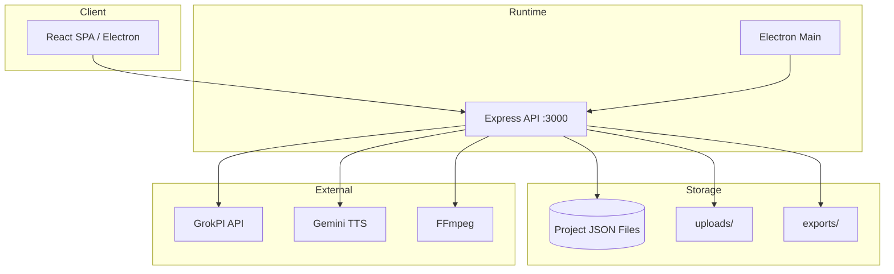

# System Architecture — MASJAVAS Film V5

## Overview

MASJAVAS Film V5 adalah aplikasi **hybrid desktop + web** untuk produksi video sinematik berbasis adegan dengan integrasi AI (GrokPI, Gemini TTS) dan FFmpeg.

## Komponen

| Layer | Tanggung jawab |
|-------|----------------|
| `src/` | UI, state Zustand, klien HTTP |
| `server/` | REST API, validasi, queue render, export |
| `desktop/` | Window, embedded server, AppData paths |
| `tests/` | Vitest unit/integration/API/E2E |

## Data flow

1. User mengisi alur wizard → state di Zustand
2. Autosave → `PUT /api/projects/:id/snapshot` → JSON disk
3. Generate media → `grokpiClient` → file di `uploads/`
4. Export → `ffmpegService` → `exports/final.mp4`

## Deployment topologies

- **Desktop:** Electron + local Express + `%APPDATA%`
- **Docker:** single container `SERVE_STATIC=true`
- **VPS:** PM2 + Nginx reverse proxy + SSL