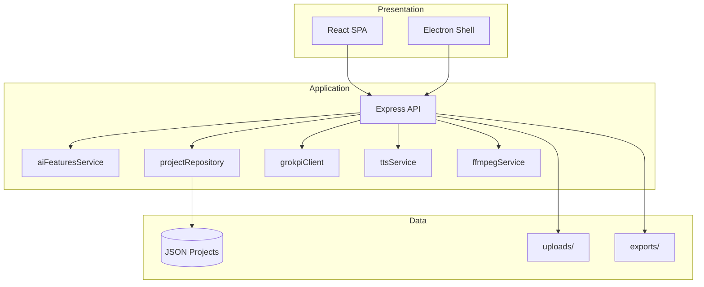
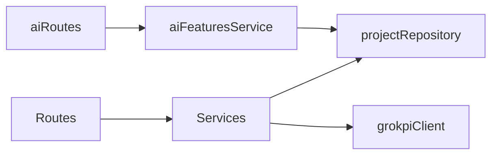

# Codebase Analysis — MASJAVAS Film V5 v1.1.0

## Executive summary

Production-grade **hybrid Electron + Express + React** application for AI-assisted cinematic video production. Storage is file-based JSON (no SQL). External AI via GrokPI and Gemini TTS.

## Technology stack

| Layer | Technology |
|-------|------------|
| Frontend | React 18, TypeScript, Vite 5, Tailwind 3, Zustand, HashRouter |
| Desktop | Electron 42, electron-builder |
| Backend | Node 20+, Express 5, Multer |
| Testing | Vitest, Supertest |
| CI/CD | GitHub Actions |
| Container | Docker, docker-compose |

## Project structure

```
src/           → UI pages, stores, services
server/        → API, domain services, middleware
desktop/       → Electron lifecycle
tests/         → unit, api, integration, e2e
deploy/        → nginx, PM2
docs/          → analysis, FFmpeg setup
public/        → SEO assets
.github/       → workflows
```

## Database

**None (SQL).** Persistence:

- `server/data/projects/{id}.json` (+ `.backup.json`)
- Desktop: `%APPDATA%/MASJAVAS AI/data/projects/`
- Browser: `localStorage` cache offline

`projectRepository.js` — CRUD + list cache (5s TTL).

## External APIs

| API | Usage |
|-----|--------|
| GrokPI | Images, video generation |
| Gemini | TTS narration |
| FFmpeg | Export/transcode (local binary) |

## Build system

| Command | Output |
|---------|--------|
| `npm run dev` | Vite :5174 |
| `npm run build` | `dist/` |
| `npm run desktop:build` | `release/*.exe` |
| `npm start` | API + static SPA :3000 |

## Deployment process

1. Dev: `npm run dev:all`
2. Docker: `docker compose up -d`
3. VPS: PM2 + Nginx + SSL (`deploy/`)
4. CI: push → test → build; tag → release

## Security risks (mitigated v1.1)

| Risk | Mitigation |
|------|------------|
| API keys in repo | `.gitignore`, env-only, audit |
| Open debug routes | `localOnly` middleware |
| Upload abuse | MIME filter, 10MB, rate limit |
| CORS wide open | OK for local; restrict at Nginx in prod |

## Technical debt

| Item | Priority |
|------|----------|
| No SQL multi-tenant | Medium — file JSON OK until 10k+ projects/server |
| AI chat heuristic (not LLM) | Low — upgrade path documented |
| FFmpeg not in Git | By design — `docs/FFMPEG_SETUP.md` |
| Lighthouse not in CI | Low — manual/scheduled audit |

## Architecture diagram



## Module dependency (core)



## v1.1 additions

- `/api/ai/*` — recommendations, search, summary, genre, chat
- `/api/metrics`, `/api/monitoring/errors`
- Rate limiting + security headers + error tracking
- 8+ test files, 80% coverage threshold on core server modules