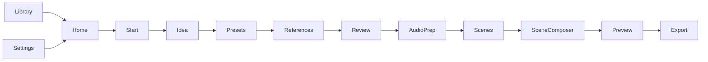
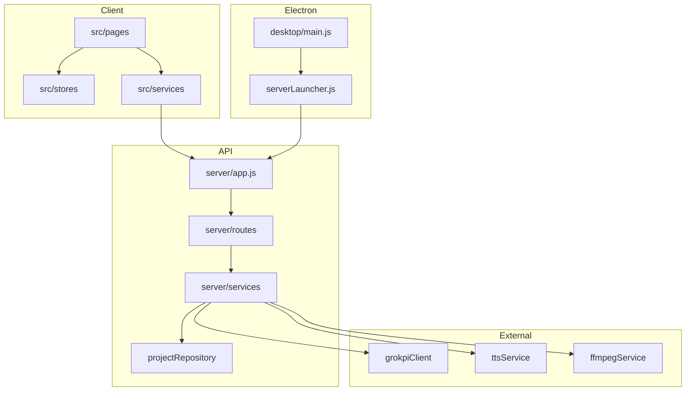

# Codebase Analysis — MASJAVAS Film V5

## Teknologi

| Lapisan | Stack |
|---------|--------|
| Frontend | React 18, TypeScript 5, Vite 5, Tailwind 3, Zustand, React Router 6 (HashRouter) |
| Desktop | Electron 42, electron-builder (NSIS) |
| Backend | Node.js 20+, Express 5, Multer |
| Storage | File JSON (`server/data/projects/`), localStorage cache |
| Media | FFmpeg (lokal), static `/uploads`, `/exports` |
| AI | GrokPI REST, Gemini TTS |

## Struktur folder

```
masjavas-film-v5/
├── src/                 # React UI
│   ├── pages/           # 14 layar alur produksi
│   ├── components/      # layout, UI, shared
│   ├── stores/          # Zustand state
│   ├── services/        # API clients
│   └── types/
├── server/              # Express API
│   ├── routes/
│   ├── services/        # domain logic
│   ├── middleware/
│   └── utils/
├── desktop/             # Electron shell
├── tests/               # Vitest
├── docs/
├── resources/           # icons, ffmpeg (lokal)
└── .github/workflows/
```

## Database

Tidak ada SQL. **Project store** = satu file JSON per proyek:

- Dev: `server/data/projects/{id}.json`
- Desktop: `%APPDATA%/MASJAVAS AI/data/projects/`

Operasi via `projectRepository.js` (list, get, save snapshot, backup `.backup.json`).

## API eksternal

| Provider | Penggunaan |
|----------|------------|
| GrokPI | Storyboard, image, video generation |
| Gemini | TTS / audio narasi |
| FFmpeg | Merge, transcode, export MP4 |

## API internal (Express)

| Prefix | Modul |
|--------|--------|
| `GET /health` | Monitoring |
| `/api/projects` | CRUD proyek |
| `/api/.../references` | Upload & auto refs |
| `/api/scenes` | Adegan, render queue |
| `/api/export` | Kompilasi final |
| `/api/tts` | Audio per adegan |
| `/api/settings` | Kunci API (AppData) |
| `/api/debug/*` | Diagnostics (localhost only) |

## Alur aplikasi



1. User membuat/membuka proyek (Library / Start)
2. Mengisi ide, preset, referensi visual
3. Review & kompresi narasi
4. TTS per adegan (Audio Prep)
5. Generate storyboard + video per adegan
6. Preview urutan adegan
7. Export MP4 + SRT + paket edit

## Dependency utama

- `react`, `react-dom`, `react-router-dom`
- `zustand`, `lucide-react`, `clsx`, `tailwind-merge`
- `express`, `cors`, `multer`, `dotenv`
- `electron`, `electron-builder` (dev)
- `vitest`, `supertest` (dev)

## Diagram relasi modul



## Mode runtime

| Mode | Frontend | Backend |
|------|----------|---------|
| `npm run dev:all` | Vite :5174 | Express :3000 |
| `npm run desktop:dev` | Vite + Electron | Embedded server |
| Docker / `npm start` | Static `dist/` | Express + SERVE_STATIC |