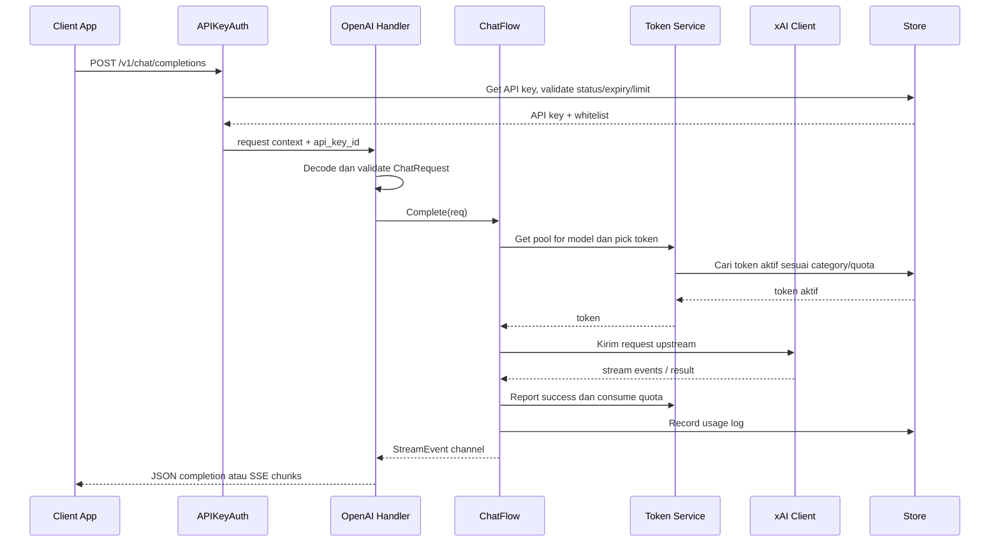
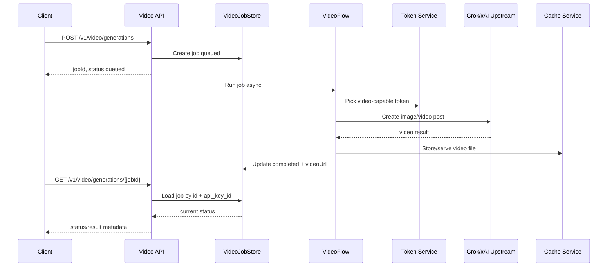
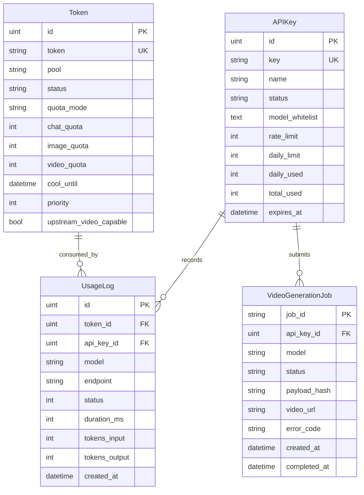

# Dokumen Backend Grokpi

## 1. Ringkasan
Backend Grokpi adalah server Go yang menjalankan Admin API, OpenAI-compatible API, token pool manager, usage logging, cache service, dan static frontend serving dalam satu aplikasi. Backend menjadi lapisan gateway antara aplikasi client dan upstream Grok/xAI.

Backend berada pada folder `cmd/` dan `internal/`. Entry point utama ada di `cmd/grokpi/main.go`, sedangkan domain internal dipisah menjadi `httpapi`, `flow`, `token`, `xai`, `store`, `config`, `cache`, `cfrefresh`, dan `logging`.

## 2. Tujuan Backend
- Menyediakan endpoint OpenAI-compatible untuk chat, image, video, dan TTS.
- Menyediakan Admin API untuk operasional token, API key, config, usage, dan cache.
- Mengelola token upstream Grok/xAI dalam pool Basic/Super.
- Memilih token yang sehat berdasarkan model, quota, status, cooldown, dan fallback.
- Menjaga API key client, whitelist model, rate limit, dan daily limit.
- Mencatat usage dan status request tanpa membocorkan rahasia.
- Mendukung self-hosting single binary, Docker Compose, SQLite, dan PostgreSQL.

## 3. Struktur Modul

```text
cmd/grokpi/
  main.go

internal/
  httpapi/     Routing, middleware, Admin API, /v1 API bridge, static SPA
  httpapi/openai/
               OpenAI-compatible models, chat, stream, image/video route, TTS, async video
  flow/        Orkestrasi chat, image, video, retry, stream events, usage recording
  token/       Token service, picker, quota, policy, category, refresh, health
  xai/         Client upstream Grok/xAI, websocket, upload, image/video/chat/TTS adapters
  store/       GORM models dan repository untuk token, API key, usage, config, video jobs
  cache/       Local cache service untuk file media
  config/      TOML config, defaults, runtime hot-reload
  cfrefresh/   Scheduler dan solver refresh Cloudflare/session bila dibutuhkan
  logging/     Setup logging
```

## 4. Arsitektur Backend

```mermaid
flowchart LR
    Client[Aplikasi Client] --> V1[/v1 API]
    Admin[Admin Console] --> AdminAPI[/admin API]
    V1 --> Auth[APIKeyAuth]
    AdminAPI --> AppAuth[AppKeyAuth]
    Auth --> OpenAI[OpenAI Handler]
    OpenAI --> ChatFlow[Chat/Image/Video/TTS Flow]
    ChatFlow --> TokenSvc[Token Service]
    TokenSvc --> Store[(DB Store)]
    ChatFlow --> XAI[xAI Client]
    XAI --> Upstream[Grok/xAI Upstream]
    ChatFlow --> Usage[Usage Recorder]
    Usage --> Store
    OpenAI --> Cache[Video Cache]
    AdminAPI --> Store
    AdminAPI --> Runtime[Runtime Config]
```

## 5. Routing Utama
| Route | Auth | Fungsi |
| --- | --- | --- |
| `GET /health` | Tidak | Health check. |
| `GET /healthz` | Tidak | Health check alias. |
| `GET /api/files/video/{name}` | Tidak | Public serving video cache. |
| `GET /v1/models` | API key | Daftar model yang tersedia. |
| `POST /v1/preflight` | API key | Preflight token/model. |
| `POST /v1/chat/completions` | API key | Chat, tool calling, image, video sync. |
| `POST /v1/video/generations` | API key | Submit async video job. |
| `GET /v1/video/generations/{jobId}` | API key | Polling status video job. |
| `GET /v1/video/generations/{jobId}/result` | API key | Ambil metadata hasil video. |
| `POST /v1/audio/speech` | API key | TTS OpenAI-compatible. |
| `POST /v1/tts` | API key | Native xAI TTS proxy. |
| `POST /admin/login` | Tidak | Login admin memakai app key. |
| `/admin/*` | App key/session | Admin API token, API key, usage, config, cache. |
| `/*` | Tidak | Frontend SPA catch-all. |

## 6. OpenAI-Compatible Request Flow



## 7. Media Routing
Backend membedakan request berdasarkan model:

| Model/Endpoint | Flow |
| --- | --- |
| Chat model `grok-*` | `ChatFlow.Complete` |
| `grok-imagine-1.0` | Image generation flow via chat route |
| `grok-imagine-1.0-fast` | Image generation dengan default fast config |
| `grok-imagine-1.0-edit` | Image edit, wajib ada `image_url` |
| `grok-imagine-1.0-video` via chat | Video sync, response dalam format chat completion |
| `/v1/video/generations` | Async video job, polling status/result |
| `/v1/audio/speech` | TTS OpenAI-compatible, response binary audio |
| `/v1/tts` | Native xAI TTS proxy |

## 8. Async Video Flow



## 9. Database Model
| Model | Fungsi |
| --- | --- |
| `APIKey` | API key client, status, whitelist model, rate limit, daily limit, usage counter, expiry. |
| `Token` | Token upstream, pool, status, quota chat/image/video, cooldown, refresh metadata, priority, video capability. |
| `UsageLog` | Audit penggunaan per request: token, API key, model, endpoint, status, latency, token count. |
| `VideoGenerationJob` | Lifecycle job video async, job id, request metadata, status, video URL, error, timestamps. |
| `ConfigEntry` | Runtime config key-value yang dapat dikelola dari Admin Console. |



## 10. Token Pool dan Quota
Token dipilih berdasarkan model dan kategori request.

| Kategori | Dipakai Oleh |
| --- | --- |
| Chat | Chat completion dan reasoning. |
| Image | Image generate/edit. |
| Video | Video sync/async. |

Aturan utama:
- Model dipetakan ke pool Basic/Super melalui konfigurasi token.
- Jika model tersedia di dua pool, `preferred_pool` menjadi prioritas.
- Token dengan status tidak sehat tidak boleh dipilih.
- Quota dikonsumsi hanya pada success.
- Error 401/403 token-level menandai token expired/invalid.
- Rate limit/cooling menurunkan ketersediaan token sementara.
- Retry dibatasi oleh `MaxTokens`, `PerTokenRetries`, backoff, dan retry budget.

## 11. Admin API Responsibilities
| Area | Responsibility |
| --- | --- |
| Auth | Login, verify, logout, cookie/session admin. |
| System | Status sistem, uptime, version, summary token/API key. |
| Config | Read/update config runtime dari database/config provider. |
| Token | CRUD token, batch import/export, replace, reset usage, refresh, revalidate, sync quota. |
| API Key | CRUD API key, regenerate, stats, whitelist, limits. |
| Usage | Usage stats dan request logs. |
| Cache | Stats, list, serve, delete, clear cache. |

## 12. Security Backend
- `/v1/*` wajib memakai `Authorization: Bearer <API_KEY>`.
- `/admin/*` selain login wajib memakai admin auth/session.
- API key list/detail wajib masked; full key hanya muncul saat create/regenerate.
- Upstream token tidak boleh ditulis utuh ke log atau response.
- Middleware security headers, request timeout, dan body size limit aktif secara global.
- Health endpoint tanpa auth hanya boleh mengembalikan status non-rahasia.
- Production wajib di belakang HTTPS reverse proxy.

## 13. Observability dan Error Handling
- Setiap request sukses dicatat ke `usage_logs`.
- Error response memakai shape JSON stabil dengan `error.type`, `error.code`, dan message.
- Stream response mengirim SSE chunk dan menutup dengan `[DONE]`.
- Video async menyimpan error code/message di job record.
- Token error mengubah status token agar admin dapat audit dari UI.
- Request ID middleware aktif untuk membantu tracing log.

## 14. Deployment Backend
Requirement minimum:
- Linux server/VPS, Ubuntu 22.04+ atau Debian 12.
- Docker dan Docker Compose.
- Go 1.24+ dan Node.js 20+ untuk build lokal.
- Minimal 2 vCPU / 2 GB RAM untuk penggunaan ringan.
- Port 8080 atau reverse proxy ke 80/443.

Alur deploy ringkas:

```bash
cp config.defaults.toml config.toml
make build
docker compose up -d --build
curl -s http://127.0.0.1:8080/health
```

## 15. Acceptance Criteria
- `/health` dan `/healthz` mengembalikan status ok.
- `/v1/models` hanya mengembalikan model yang tersedia dan diizinkan API key.
- `/v1/chat/completions` mendukung JSON non-stream dan SSE stream.
- Image, image edit, video sync, async video, dan TTS berjalan sesuai model/endpoint.
- API key auth menolak key invalid, inactive, expired, rate limited, atau daily limit exhausted.
- Token pool mengonsumsi quota sesuai kategori dan mencatat usage pada success.
- Admin API dapat mengelola token, API key, config, usage, dan cache.
- Video async hanya dapat diakses oleh API key pemilik job.
- Build produksi dapat menjalankan backend dan frontend embedded dalam satu service.

