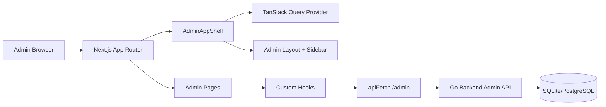
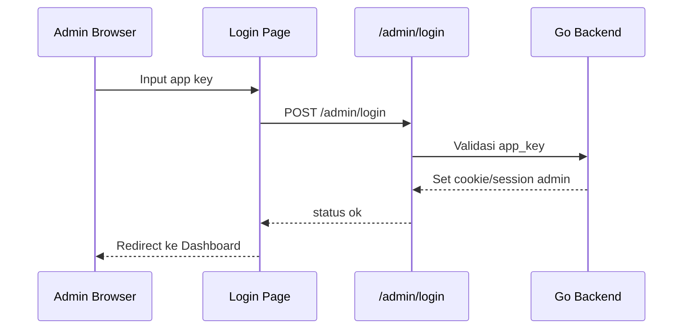
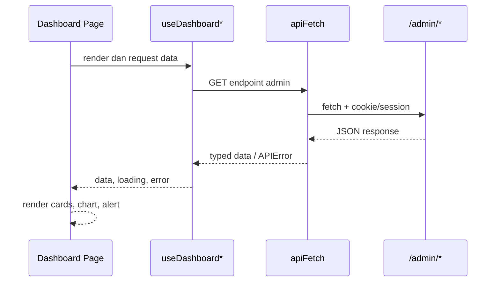

# Dokumen Frontend Grokpi

## 1. Ringkasan
Frontend Grokpi adalah Admin Console berbasis web untuk mengoperasikan gateway Grokpi. Fokus utama frontend adalah memberi admin kontrol atas token pool, API key, usage, cache, konfigurasi runtime, dan observability sistem tanpa perlu mengakses database atau file konfigurasi secara manual.

Frontend berada di folder `web/`, dibangun dengan Next.js, React, TypeScript, TanStack Query, dan komponen UI lokal. Pada build produksi, frontend di-embed ke binary Go dan disajikan oleh backend yang sama.

## 2. Tujuan Frontend
- Menyediakan dashboard operasional untuk melihat status Grokpi secara cepat.
- Memudahkan admin mengelola token upstream Basic/Super.
- Memudahkan admin membuat dan membatasi API key client.
- Menampilkan usage, quota, cache, dan status sistem secara jelas.
- Menyediakan UI konfigurasi runtime tanpa edit manual `config.toml`.
- Menjaga rahasia tetap aman dengan masking API key/token dan session admin.

## 3. Struktur Aplikasi

```text
web/
  src/
    app/
      (auth)/login/page.tsx
      (admin)/dashboard/page.tsx
      (admin)/tokens/page.tsx
      (admin)/apikeys/page.tsx
      (admin)/usage/page.tsx
      (admin)/cache/page.tsx
      (admin)/settings/page.tsx
      (admin)/function/page.tsx
    components/
      layout/
      features/
      ui/
    lib/
      api-client.ts
      hooks/
      i18n/
      query-provider.tsx
      validations/
    types/
```

## 4. Halaman Utama
| Halaman | Fungsi |
| --- | --- |
| Login | Autentikasi admin memakai `app_key` backend. |
| Dashboard | Ringkasan uptime, token stats, API key stats, quota pool, usage chart, dan status sistem. |
| Tokens | CRUD token upstream, batch import/export, sync quota, reset usage, replace token, refresh/revalidate, dan video capability test. |
| API Keys | CRUD API key client, regenerate key, whitelist model, rate limit, daily limit, expiry, dan status. |
| Usage | Melihat usage log dan agregasi penggunaan berdasarkan periode/model/status/API key. |
| Cache | Melihat cache file, cache stats, preview/download, delete selected, dan clear cache. |
| Settings | Mengubah konfigurasi runtime seperti app, proxy, retry, model defaults, image/video defaults, dan security limit. |
| Function | Area fitur/probe tambahan untuk endpoint/fungsi provider. |

## 5. Arsitektur Frontend



## 6. Alur Login Admin



## 7. Data Fetching dan State
Frontend memakai pola server-state, bukan global store manual.

- `api-client.ts` menjadi wrapper fetch utama ke prefix `/admin`.
- Jika response `401`, frontend otomatis redirect ke `/login/`.
- `TanStack Query` mengatur cache, loading state, refetch, dan invalidation.
- Hook seperti `useSystemStatus`, `useTokens`, `useAPIKeyStats`, `useUsageLogs`, dan `useCache` menjadi batas antara UI dan API.
- Form memakai validasi typed schema saat tersedia, terutama untuk token, API key, dan config.

Contoh alur data:



## 8. Komponen UI
| Area | Komponen |
| --- | --- |
| Layout | `AdminAppShell`, `AdminLayout`, sidebar, header, error fallback. |
| Feedback | Alert, toast, skeleton, progress, status badge. |
| Form | Input, textarea, select, switch, checkbox, dialog, confirm dialog. |
| Data | Table, tabs, dropdown menu, token table, cache file table, request log. |
| Dashboard | Stat cards, quota cards, usage chart, ops studio. |
| Media/Function | Chat panel, image grid, imagine panel, video panel, markdown renderer. |

## 9. Integrasi Endpoint Admin
| Endpoint | Dipakai Untuk |
| --- | --- |
| `POST /admin/login` | Login admin. |
| `GET /admin/verify` | Verifikasi session admin. |
| `POST /admin/logout` | Logout. |
| `GET /admin/system/status` | Uptime, version, token/API key summary. |
| `GET /admin/system/usage` | Agregasi usage dashboard. |
| `GET /admin/usage/logs` | Tabel usage log. |
| `GET/PUT /admin/config` | Lihat dan update konfigurasi runtime. |
| `GET/PATCH/DELETE /admin/tokens/{id}` | Manajemen token. |
| `POST /admin/tokens/batch` | Batch import/export token. |
| `POST /admin/tokens/{id}/sync-quota` | Sinkron quota token. |
| `POST /admin/tokens/{id}/refresh` | Refresh token official. |
| `POST /admin/tokens/{id}/test-video-capability` | Cek kemampuan video token. |
| `GET/POST/PATCH/DELETE /admin/apikeys` | Manajemen API key client. |
| `GET/POST /admin/cache/*` | Stats, list, delete, clear, dan serve cache. |

## 10. Requirement UX
- Dashboard harus memprioritaskan status operasional: health, quota, token state, API key state, dan usage.
- Tabel token/API key/cache harus mendukung scanning cepat melalui status badge, filter, pagination, dan aksi baris.
- Operasi destruktif seperti delete token, delete cache, dan clear cache wajib memakai confirm dialog.
- Loading state wajib memakai skeleton/progress yang tidak menggeser layout secara ekstrem.
- Error backend harus ditampilkan berdasarkan `APIError.code` dan pesan yang aman.
- API key/token tidak boleh ditampilkan penuh kecuali saat create/regenerate sesuai response backend.

## 11. Security Frontend
- Jangan menyimpan upstream token atau API key client di localStorage frontend publik.
- Admin Console hanya boleh menampilkan token/key dalam bentuk masked pada list/detail.
- Session admin ditangani oleh backend; frontend cukup memakai fetch relatif ke `/admin`.
- Semua form sensitif harus menghindari logging payload di console.
- Production wajib melalui HTTPS agar cookie/session dan form rahasia tidak lewat plaintext.

## 12. Acceptance Criteria
- Admin bisa login dan diarahkan ke dashboard.
- Dashboard menampilkan status sistem, token stats, API key stats, quota, usage, dan alert error bila API gagal.
- Admin bisa membuat, memperbarui, menghapus, regenerate, dan membatasi API key.
- Admin bisa import/update token, sync quota, refresh/revalidate, reset usage, dan test video capability.
- Admin bisa melihat usage log serta cache file, lalu menghapus cache yang tidak diperlukan.
- Settings runtime dapat dibaca dan disimpan tanpa reload manual server.
- Jika session admin invalid, UI redirect ke login.

