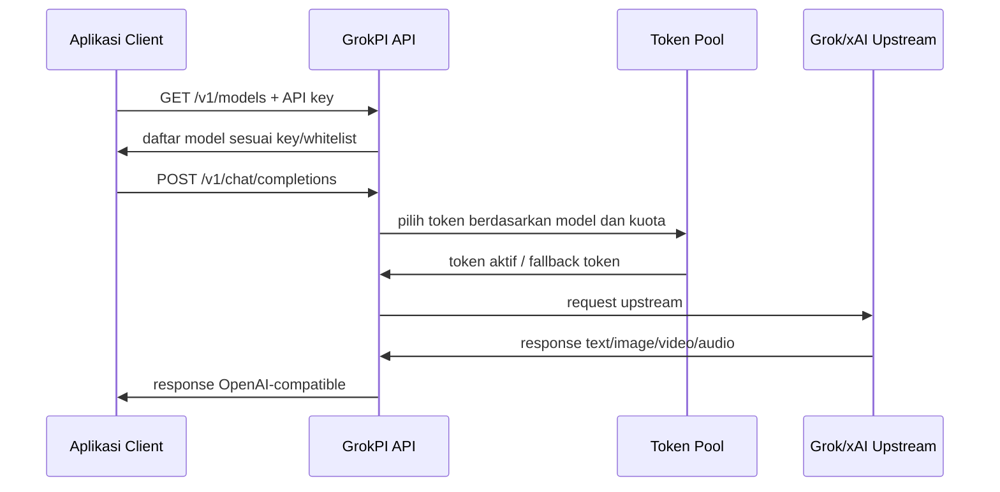
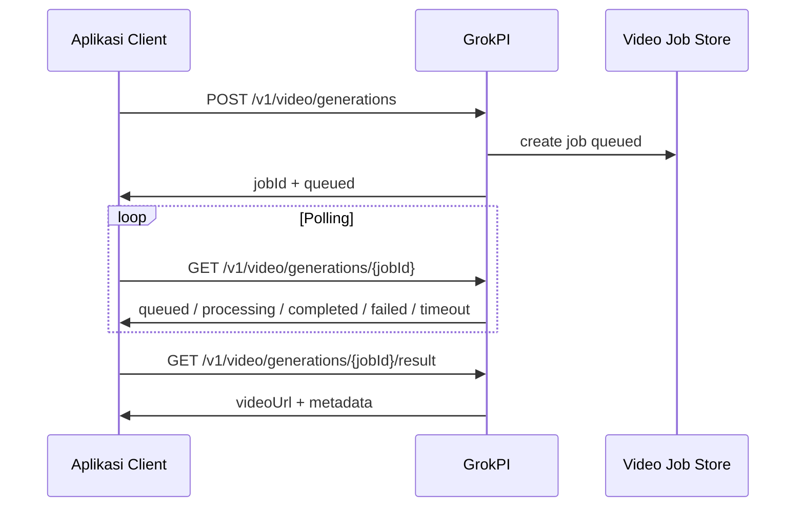

# DOKUMEN SISTEM KERJA PROVIDER GROKPI

Dokumen ini menjelaskan cara kerja GrokPI sebagai provider AI dan gateway integrasi untuk semua aplikasi MASJAVAS. Fokus dokumen:

- GrokPI sebagai model orchestrator, LLM/chat, text-to-image, image edit, text-to-video, image-to-video, dan text-to-speech.
- Model yang bisa digunakan oleh aplikasi.
- Endpoint, payload, response, auth, kuota, token pool, dan pola integrasi.
- Rasio video, resolusi, durasi, dan ukuran output sesuai opsi pada screenshot UI.

Sumber lokal yang dipakai:

- Project GrokPI: `D:\Masjavas\grokpi`
- API reference lokal: `D:\Masjavas\grokpi\api.md`
- Config model pool: `D:\Masjavas\grokpi\config.toml`
- Info server: `SERVER grokpi masjavas.txt`

Catatan keamanan: dokumen ini tidak menulis password, API key, cookie, atau token asli. Gunakan placeholder seperti `<GROKPI_API_KEY>` dan simpan rahasia di `.env`, secret manager, atau konfigurasi server.

---

## 1. Ringkasan Fungsi GrokPI

GrokPI adalah gateway self-hosted yang menyediakan API kompatibel OpenAI untuk workload Grok/xAI. Aplikasi lain cukup menghubungi GrokPI, lalu GrokPI yang mengatur token upstream, model pool, retry, kuota, cache video, dan response format.

Peran GrokPI dalam arsitektur MASJAVAS:

| Peran | Fungsi |
| --- | --- |
| Provider pusat | Satu pintu untuk akses model Grok/xAI |
| Orchestrator model | Memilih model sesuai task: planner, LLM, image, video, TTS |
| LLM/chat gateway | Endpoint chat completion OpenAI-style |
| Media generator | Text-to-image, image edit, text-to-video, image-to-video |
| Token pool manager | Mengelola token Basic/Super, cooldown, quota, dan fallback |
| API compatibility layer | Membuat aplikasi mudah memakai client OpenAI-compatible |
| Admin console | Kelola token, API key, usage, settings, dan cache |
| Video async job manager | Submit job video, polling status, dan ambil result |

---

## 2. Base URL dan Auth

Gunakan URL sesuai environment:

| Environment | Base URL |
| --- | --- |
| Production | `https://www.grokpi.masjavas.my.id` |
| Local/VPS internal | `http://127.0.0.1:8080` |

Health check tanpa auth:

```http
GET /health
GET /healthz
```

Semua endpoint `/v1/*` memakai API key:

```http
Authorization: Bearer <GROKPI_API_KEY>
Content-Type: application/json
```

Jangan gunakan password admin sebagai API key. API key dibuat dari Admin Console GrokPI.

---

## 3. Endpoint Utama

| Method | Path | Auth | Fungsi |
| --- | --- | --- | --- |
| `GET` | `/health` | Tidak | Cek status server |
| `GET` | `/v1/models` | API key | Ambil model tersedia untuk API key |
| `POST` | `/v1/chat/completions` | API key | Chat, orchestration, image, video via OpenAI-style payload |
| `POST` | `/v1/video/generations` | API key | Submit async video generation job |
| `GET` | `/v1/video/generations/{jobId}` | API key | Polling status video job |
| `GET` | `/v1/video/generations/{jobId}/result` | API key | Ambil metadata hasil video |
| `POST` | `/v1/audio/speech` | API key | Text-to-speech OpenAI-style |
| `POST` | `/audio/speech` | API key | Alias root untuk TTS probe |
| `POST` | `/v1/tts` | API key | Proxy payload native xAI TTS |
| `GET` | `/api/files/video/{name}` | Tidak | Ambil file video cache hasil generate |

Rekomendasi:

- Gunakan `/v1/chat/completions` untuk integrasi umum karena kompatibel dengan pola OpenAI.
- Gunakan `/v1/video/generations` untuk workflow video produksi karena video bisa lama dan lebih aman diproses async.
- Selalu panggil `/v1/models` saat aplikasi start agar daftar model mengikuti config/whitelist terbaru.

---

## 4. Model Yang Bisa Digunakan

Daftar berikut berasal dari konfigurasi GrokPI saat dokumen ini dibuat. Daftar real-time dapat berubah mengikuti `token.basic_models`, `token.super_models`, status token, dan whitelist API key.

### 4.1 Model Chat / LLM

| Model ID | Kegunaan |
| --- | --- |
| `grok-3` | LLM umum |
| `grok-3-mini` | LLM ringan dan cepat |
| `grok-3-thinking` | Reasoning/planning |
| `grok-4` | LLM utama kualitas tinggi |
| `grok-4-mini` | LLM cepat dan ekonomis |
| `grok-4-thinking` | Reasoning kompleks |
| `grok-4-heavy` | Reasoning/analysis berat |
| `grok-4.1-fast` | LLM cepat untuk produksi |
| `grok-4.1-mini` | LLM ringan untuk task sederhana |
| `grok-4.1-thinking` | Reasoning dan planning |
| `grok-4.1-expert` | Orchestrator/agent expert |
| `grok-4.20-beta` | Model beta/eksperimen |

### 4.2 Model Image

| Model ID | Kegunaan |
| --- | --- |
| `grok-imagine-1.0` | Text-to-image |
| `grok-imagine-1.0-fast` | Text-to-image cepat dengan default fast |
| `grok-imagine-1.0-edit` | Image edit / image-to-image |

### 4.3 Model Video

| Model ID | Kegunaan |
| --- | --- |
| `grok-imagine-1.0-video` | Text-to-video dan image-to-video |

### 4.4 Model Audio

| Model ID | Kegunaan |
| --- | --- |
| `grok-tts` | Text-to-speech |

---

## 5. Rekomendasi Pemilihan Model per Aplikasi

| Use Case | Model utama | Alternatif |
| --- | --- | --- |
| Orchestrator agent / planner | `grok-4.1-expert` | `grok-4-heavy`, `grok-4-thinking`, `grok-4.1-thinking` |
| LLM cepat untuk UI/app | `grok-4.1-fast` | `grok-4-mini`, `grok-3-mini` |
| Reasoning murah/sedang | `grok-4.1-thinking` | `grok-3-thinking` |
| Prompt rewrite / prompt enhancer | `grok-4.1-fast` | `grok-4.1-mini` |
| Script film / scene breakdown | `grok-4.1-expert` | `grok-4`, `grok-4-thinking` |
| Text-to-image | `grok-imagine-1.0` | `grok-imagine-1.0-fast` |
| Image edit / reference image | `grok-imagine-1.0-edit` | - |
| Text-to-video | `grok-imagine-1.0-video` | - |
| Image-to-video | `grok-imagine-1.0-video` + `image_url` | - |
| Narasi audio | `grok-tts` | - |

Untuk aplikasi produksi, buat fallback:

1. Cek `/v1/models`.
2. Pilih model utama.
3. Jika tidak tersedia, pakai model alternatif.
4. Jika tetap tidak tersedia, tampilkan error UX yang jelas: model belum aktif/whitelist/token habis.

---

## 6. Sistem Kerja Request

Alur standar semua aplikasi:



Untuk video async:



---

## 7. OpenAI-Compatible Chat / Orchestrator

Endpoint:

```http
POST /v1/chat/completions
```

Field umum:

| Field | Wajib | Keterangan |
| --- | --- | --- |
| `model` | Ya | Model target |
| `messages` | Ya | Chat history atau multimodal blocks |
| `stream` | Tidak | `true` untuk SSE stream |
| `temperature` | Tidak | `0` sampai `2` |
| `top_p` | Tidak | `0` sampai `1` |
| `max_tokens` | Tidak | Batas output token |
| `reasoning_effort` | Tidak | `none|minimal|low|medium|high|xhigh` |
| `tools` | Tidak | Tool definitions untuk function/tool calling |
| `tool_choice` | Tidak | `auto|required|none` atau object function |
| `parallel_tool_calls` | Tidak | Default `true` |
| `image_config` | Tidak | Untuk model image |
| `video_config` | Tidak | Untuk model video |

Contoh LLM/orchestrator:

```json
{
  "model": "grok-4.1-expert",
  "stream": false,
  "messages": [
    {
      "role": "system",
      "content": "Anda adalah orchestrator MASJAVAS AI Film Studio. Pecah tugas menjadi rencana produksi yang bisa dieksekusi."
    },
    {
      "role": "user",
      "content": "Buat breakdown 8 scene untuk film pendek Majapahit cinematic."
    }
  ],
  "temperature": 0.7,
  "reasoning_effort": "high"
}
```

Format multimodal yang disarankan:

```json
{
  "role": "user",
  "content": [
    { "type": "text", "text": "Analisis gambar ini dan buat prompt video cinematic." },
    { "type": "image_url", "image_url": { "url": "data:image/png;base64,..." } }
  ]
}
```

---

## 8. Text-to-Image

Model:

- `grok-imagine-1.0`
- `grok-imagine-1.0-fast`

Endpoint:

```http
POST /v1/chat/completions
```

`image_config`:

| Field | Default | Batasan |
| --- | --- | --- |
| `n` | `1` | `1` sampai `10` |
| `size` | `1024x1024` | Lihat tabel ukuran |
| `response_format` | `b64_json` | Dinormalisasi ke `b64_json` |
| `enable_nsfw` | Mengikuti server | Opsional |

Ukuran image yang diizinkan:

| Size | Rasio | Cocok untuk |
| --- | --- | --- |
| `1024x1024` | `1:1` | Square post, thumbnail, avatar |
| `1024x1792` | `9:16` / vertical | Story, short video reference |
| `1792x1024` | `16:9` / wide | Film frame, YouTube, cinematic |
| `1280x720` | `16:9` | Preview/video frame |
| `720x1280` | `9:16` | TikTok/Reels/Shorts |

Contoh request:

```json
{
  "model": "grok-imagine-1.0",
  "stream": false,
  "messages": [
    {
      "role": "user",
      "content": "Cinematic portrait of a Majapahit queen, golden necklace, realistic film lighting"
    }
  ],
  "image_config": {
    "n": 1,
    "size": "1792x1024",
    "response_format": "b64_json"
  }
}
```

Catatan output:

- Image biasanya dikembalikan sebagai markdown image dengan data URI base64.
- Aplikasi perlu mengekstrak base64/data URI dari response content.
- Untuk stream image, `image_config.n` hanya boleh `1` atau `2`.

---

## 9. Image Edit / Image-to-Image

Model:

- `grok-imagine-1.0-edit`

Syarat:

- Minimal 1 gambar dikirim melalui block `image_url`.
- Gambar bisa berupa URL publik atau data URI base64.

Contoh request:

```json
{
  "model": "grok-imagine-1.0-edit",
  "stream": false,
  "messages": [
    {
      "role": "user",
      "content": [
        { "type": "text", "text": "Ubah gambar ini menjadi cinematic Majapahit royal costume, tetap pertahankan pose." },
        { "type": "image_url", "image_url": { "url": "data:image/png;base64,..." } }
      ]
    }
  ],
  "image_config": {
    "n": 1,
    "size": "1024x1024"
  }
}
```

---

## 10. Text-to-Video dan Image-to-Video

Model:

- `grok-imagine-1.0-video`

Endpoint yang bisa dipakai:

- Sync/OpenAI-style: `POST /v1/chat/completions`
- Async produksi: `POST /v1/video/generations`

`video_config`:

| Field | Default | Batasan |
| --- | --- | --- |
| `aspect_ratio` | `3:2` | `2:3`, `3:2`, `1:1`, `9:16`, `16:9` |
| `video_length` | `6` | API menerima `6` sampai `30` detik |
| `resolution_name` | `480p` | `480p` atau `720p` |
| `preset` | `custom` | `custom`, `fun`, `normal`, `spicy` |

Opsi sesuai screenshot UI:

| Kontrol UI | Opsi |
| --- | --- |
| Mode | `Video` |
| Resolusi | `480p`, `720p` |
| Durasi terlihat | `6s`, `10s` |
| Rasio | `2:3 Tall`, `3:2 Wide`, `1:1 Square`, `9:16 Vertical`, `16:9 Widescreen` |
| Rasio terpilih pada screenshot | `2:3 Tall` |
| Durasi terpilih pada screenshot | `10s` |
| Resolusi terpilih pada screenshot | `480p` |

Catatan durasi: UI pada screenshot menampilkan preset `6s` dan `10s`, sedangkan API GrokPI menerima `video_length` dari `6` sampai `30` detik. Untuk parity dengan screenshot, aplikasi sebaiknya menampilkan tombol cepat `6s` dan `10s`, lalu boleh menyediakan input advanced untuk `6-30s`.

### 10.1 Rasio Video Yang Diterima

| Input UI | Nilai API | Alias size yang diterima |
| --- | --- | --- |
| `2:3 Tall` | `2:3` | `1024x1792` |
| `3:2 Wide` | `3:2` | `1792x1024` |
| `1:1 Square` | `1:1` | `1024x1024` |
| `9:16 Vertical` | `9:16` | `720x1280` |
| `16:9 Widescreen` | `16:9` | `1280x720` |

### 10.2 Mapping Resolusi + Rasio ke Size Internal

Server menghitung ukuran internal berdasarkan tinggi:

- `480p`: tinggi `480`
- `720p`: tinggi `720`
- lebar = `tinggi * rasio_w / rasio_h`

| Resolusi | Rasio | Size internal |
| --- | --- | --- |
| `480p` | `2:3` | `320x480` |
| `480p` | `3:2` | `720x480` |
| `480p` | `1:1` | `480x480` |
| `480p` | `9:16` | `270x480` |
| `480p` | `16:9` | `853x480` |
| `720p` | `2:3` | `480x720` |
| `720p` | `3:2` | `1080x720` |
| `720p` | `1:1` | `720x720` |
| `720p` | `9:16` | `405x720` |
| `720p` | `16:9` | `1280x720` |

### 10.3 Contoh Text-to-Video

```json
{
  "model": "grok-imagine-1.0-video",
  "stream": false,
  "messages": [
    {
      "role": "user",
      "content": [
        { "type": "text", "text": "A cinematic slow push-in shot of a Majapahit queen wearing golden jewelry, dramatic warm light, shallow depth of field" }
      ]
    }
  ],
  "video_config": {
    "aspect_ratio": "2:3",
    "video_length": 10,
    "resolution_name": "480p",
    "preset": "normal"
  }
}
```

### 10.4 Contoh Image-to-Video

Jika ada block `image_url`, GrokPI memakai gambar pertama sebagai `reference_image`.

```json
{
  "model": "grok-imagine-1.0-video",
  "stream": false,
  "messages": [
    {
      "role": "user",
      "content": [
        { "type": "text", "text": "Animate this image with subtle camera movement, fabric motion, cinematic lighting, no face distortion." },
        { "type": "image_url", "image_url": { "url": "data:image/png;base64,..." } }
      ]
    }
  ],
  "video_config": {
    "aspect_ratio": "16:9",
    "video_length": 10,
    "resolution_name": "720p",
    "preset": "normal"
  }
}
```

### 10.5 Contoh Async Video

Submit:

```http
POST /v1/video/generations
Authorization: Bearer <GROKPI_API_KEY>
Content-Type: application/json
```

Body:

```json
{
  "model": "grok-imagine-1.0-video",
  "messages": [
    {
      "role": "user",
      "content": "A wide cinematic shot of tropical forest, mist, ancient stone temple, film grain"
    }
  ],
  "video_config": {
    "aspect_ratio": "16:9",
    "video_length": 10,
    "resolution_name": "720p",
    "preset": "normal"
  }
}
```

Response awal:

```json
{
  "jobId": "vid_job_xxx",
  "status": "queued",
  "model": "grok-imagine-1.0-video",
  "createdAt": "2026-05-16T19:09:22Z",
  "updatedAt": "2026-05-16T19:09:22Z"
}
```

Polling:

```http
GET /v1/video/generations/{jobId}
Authorization: Bearer <GROKPI_API_KEY>
```

Status:

| Status | Arti |
| --- | --- |
| `queued` | Job masuk antrean |
| `processing` | Video sedang dibuat |
| `completed` | Video selesai |
| `failed` | Gagal |
| `timeout` | Melewati batas waktu |

Response selesai:

```json
{
  "jobId": "vid_job_xxx",
  "status": "completed",
  "model": "grok-imagine-1.0-video",
  "videoUrl": "https://www.grokpi.masjavas.my.id/api/files/video/xxx.mp4",
  "createdAt": "2026-05-16T19:09:22Z",
  "updatedAt": "2026-05-16T19:12:11Z",
  "completedAt": "2026-05-16T19:12:11Z"
}
```

---

## 11. Text-to-Speech

Model:

- `grok-tts`

Endpoint:

```http
POST /v1/audio/speech
```

Request:

```json
{
  "model": "grok-tts",
  "voice": "narrator",
  "input": "Ini adalah narasi cinematic untuk MASJAVAS AI Film Studio.",
  "response_format": "mp3",
  "language": "id"
}
```

Field:

| Field | Wajib | Default | Keterangan |
| --- | --- | --- | --- |
| `model` | Tidak | `grok-tts` | Dipakai untuk whitelist API key |
| `voice` | Tidak | `eve` | `eve`, `ara`, `rex`, `sal`, `leo`, atau alias `narrator` |
| `input` | Ya | - | Teks narasi |
| `response_format` | Tidak | `mp3` | `mp3`, `wav`, `pcm`, `mulaw`, `alaw` |
| `language` | Tidak | `id` | Kode bahasa |

Response sukses berupa binary audio langsung.

---

## 12. Token Pool, Kuota, dan Fallback

GrokPI membagi model ke pool token:

| Pool | Isi |
| --- | --- |
| Basic | Chat, image, video model standar |
| Super | Chat, heavy/expert, image, video model |

Konfigurasi penting dari `config.toml`:

| Setting | Nilai saat ini |
| --- | --- |
| `preferred_pool` | `ssoSuper` |
| `basic_cool_duration_min` | `240` menit |
| `super_cool_duration_min` | `120` menit |
| `default_chat_quota` | `100` |
| `default_image_quota` | `100` |
| `default_video_quota` | `200` |
| `max_chat_quota` | `5000` |
| `max_image_quota` | `5000` |
| `max_video_quota` | `1000` |
| `selection_algorithm` | `high_quota_first` |
| `allow_unlimited_quota` | `true` |

Format cost model:

```text
model#cost
```

Contoh:

- `grok-4-heavy#4` berarti biaya kuota model = 4.
- Tanpa `#cost`, biaya default = 1.

Alur pemilihan token:

1. Aplikasi mengirim `model`.
2. GrokPI cek apakah model ada di Basic/Super pool.
3. Jika model ada di dua pool, GrokPI memilih `preferred_pool`.
4. Token dipilih berdasarkan quota/status/cooldown.
5. Jika token kena rate limit/429, token masuk cooling.
6. GrokPI mencoba token lain sesuai retry policy.

---

## 13. Error Code Penting

| HTTP | Code | Kapan terjadi |
| --- | --- | --- |
| `400` | `invalid_json` | JSON request rusak |
| `400` | `missing_model` | Field `model` kosong |
| `400` | `invalid_messages` | Messages kosong/tidak valid |
| `400` | `invalid_temperature` | `temperature` di luar `0..2` |
| `400` | `invalid_top_p` | `top_p` di luar `0..1` |
| `400` | `invalid_image_config` | `image_config` tidak valid |
| `400` | `invalid_video_config` | `video_config` tidak valid |
| `400` | `missing_prompt` | Prompt kosong untuk image/video |
| `400` | `missing_image` | Image edit tanpa `image_url` |
| `401` | `invalid_api_key` | API key kosong/tidak valid/inactive/expired |
| `403` | `model_not_allowed` | Model tidak masuk whitelist API key |
| `403` | `media_generation_disabled` | Media generation dimatikan admin |
| `404` | `model_not_found` | Model tidak ada di config model pool |
| `429` | `rate_limit_exceeded` | Limit per menit API key terlampaui |
| `429` | `daily_limit_exceeded` | Kuota harian API key habis |

UX aplikasi sebaiknya membaca `error.code`, bukan hanya teks error.

---

## 14. Standar Integrasi Untuk Semua Aplikasi

Semua aplikasi MASJAVAS yang memakai GrokPI sebaiknya punya adapter provider seperti ini:

```ts
type GrokPiProviderConfig = {
  baseUrl: string
  apiKey: string
}

type GenerateTextInput = {
  model: string
  messages: Array<{ role: string; content: unknown }>
  stream?: boolean
  temperature?: number
  reasoning_effort?: "none" | "minimal" | "low" | "medium" | "high" | "xhigh"
}

type GenerateImageInput = GenerateTextInput & {
  image_config: {
    n?: number
    size?: "1024x1024" | "1024x1792" | "1792x1024" | "1280x720" | "720x1280"
    response_format?: "b64_json"
  }
}

type GenerateVideoInput = GenerateTextInput & {
  video_config: {
    aspect_ratio: "2:3" | "3:2" | "1:1" | "9:16" | "16:9"
    video_length: number
    resolution_name: "480p" | "720p"
    preset?: "custom" | "fun" | "normal" | "spicy"
  }
}
```

Environment variable standar:

```env
GROKPI_BASE_URL=https://www.grokpi.masjavas.my.id
GROKPI_API_KEY=<GROKPI_API_KEY>
```

Checklist integrasi aplikasi:

| Area | Wajib |
| --- | --- |
| Auth | API key disimpan di env/server-side, bukan hardcoded frontend |
| Model sync | Panggil `GET /v1/models` saat app load |
| UI filter | Filter model per tab: chat/image/video/TTS |
| Error UX | Tampilkan pesan berdasarkan `error.code` |
| Video | Pakai async endpoint untuk produksi |
| Image edit | Kirim image sebagai `image_url` block |
| Quota | Tangani `429` dan tampilkan opsi retry |
| Security | Jangan log API key/token/cookie |
| Observability | Simpan request id/job id/model/status |

---

## 15. UI Mapping Sesuai Screenshot

Screenshot menunjukkan UI imagine dengan mode Video dan opsi:

| UI Element | Mapping API |
| --- | --- |
| Prompt box `Type to imagine` | `messages[0].content` |
| Toggle `Agent (Beta)` | Gunakan LLM/orchestrator sebelum generate media |
| Toggle `Image` | Pilih model image |
| Toggle `Video` | Pilih `grok-imagine-1.0-video` |
| `480p` | `video_config.resolution_name = "480p"` |
| `720p` | `video_config.resolution_name = "720p"` |
| `6s` | `video_config.video_length = 6` |
| `10s` | `video_config.video_length = 10` |
| `2:3 Tall` | `video_config.aspect_ratio = "2:3"` |
| `3:2 Wide` | `video_config.aspect_ratio = "3:2"` |
| `1:1 Square` | `video_config.aspect_ratio = "1:1"` |
| `9:16 Vertical` | `video_config.aspect_ratio = "9:16"` |
| `16:9 Widescreen` | `video_config.aspect_ratio = "16:9"` |
| Submit arrow | Kirim request ke `/v1/video/generations` atau `/v1/chat/completions` |

Rekomendasi UI:

- Default video sesuai screenshot: `480p`, `10s`, `2:3`.
- Untuk cinematic landscape, gunakan `16:9`, `720p`, `10s`.
- Untuk Shorts/Reels/TikTok, gunakan `9:16`, `720p`, `10s`.
- Untuk portrait tall aesthetic seperti screenshot, gunakan `2:3`, `480p` atau `720p`, `10s`.
- Tampilkan advanced option untuk durasi `6-30s` jika diperlukan.

---

## 16. Contoh Integrasi dengan Client OpenAI-Compatible

Karena GrokPI kompatibel dengan format OpenAI, banyak SDK bisa diarahkan ke `baseURL` GrokPI.

Contoh JavaScript:

```ts
import OpenAI from "openai"

const client = new OpenAI({
  apiKey: process.env.GROKPI_API_KEY,
  baseURL: `${process.env.GROKPI_BASE_URL}/v1`,
})

const completion = await client.chat.completions.create({
  model: "grok-4.1-fast",
  messages: [
    { role: "user", content: "Buat prompt cinematic untuk adegan Majapahit." },
  ],
})

console.log(completion.choices[0]?.message?.content)
```

Untuk image/video yang memakai `image_config` atau `video_config`, jika SDK tidak menerima field tambahan, gunakan `fetch` manual agar payload custom tidak dibuang oleh SDK.

---

## 17. Security dan Production Rule

Wajib:

- Jangan tulis password admin, API key, upstream token, atau cookie di source code.
- Jangan expose Admin Console tanpa HTTPS.
- Gunakan reverse proxy HTTPS untuk domain production.
- Batasi akses admin jika memungkinkan.
- Rotate API key secara berkala.
- Backup `data/` dan `config.toml`.
- Monitor logs `logs/grokpi.log`.
- Gunakan API key berbeda per aplikasi agar usage mudah dipantau.
- Pakai whitelist model per API key untuk aplikasi yang hanya butuh image/video.

Jangan dilakukan:

- Jangan menyimpan `Authorization` header di localStorage frontend publik.
- Jangan mengirim API key GrokPI langsung dari browser publik jika aplikasi bisa dipakai user luar.
- Jangan menulis token upstream di dokumen, screenshot, atau log.

---

## 18. Deployment Singkat

Requirement server:

- Ubuntu 22.04+ atau Debian 12
- Docker + Docker Compose
- Go 1.24+
- Node.js 20+
- Minimal 2 vCPU / 2 GB RAM untuk penggunaan ringan
- Port `8080` atau reverse proxy ke `80/443`

Perintah umum:

```bash
cd /opt/grokpi
cp config.defaults.toml config.toml
make build
mkdir -p data logs
docker compose up -d --build
curl -s http://127.0.0.1:8080/health
```

Admin console:

```text
https://www.grokpi.masjavas.my.id/login
```

Isi yang harus dikonfigurasi:

1. Admin password/app key di `config.toml`.
2. Upstream token di Admin Console.
3. API key untuk aplikasi client.
4. Model whitelist jika perlu.
5. Kuota chat/image/video.

---

## 19. Checklist Implementasi Provider di Aplikasi Baru

1. Tambahkan env `GROKPI_BASE_URL` dan `GROKPI_API_KEY`.
2. Buat provider adapter `grokpi`.
3. Saat app load, panggil `GET /v1/models`.
4. Buat registry model berdasarkan kategori:
   - chat/orchestrator: model `grok-*`
   - image: `grok-imagine-1.0`, `grok-imagine-1.0-fast`
   - image edit: `grok-imagine-1.0-edit`
   - video: `grok-imagine-1.0-video`
   - TTS: `grok-tts`
5. Untuk text generate, panggil `/v1/chat/completions`.
6. Untuk image generate/edit, panggil `/v1/chat/completions` dengan `image_config`.
7. Untuk video produksi, panggil `/v1/video/generations` lalu polling.
8. Untuk image-to-video, kirim `image_url` sebagai reference image.
9. Parse response media:
   - image: markdown image/data URI base64
   - video: markdown link atau `videoUrl`
   - audio: binary response
10. Tangani error code dan retry.
11. Log `model`, `jobId`, `status`, durasi request, dan error code tanpa membocorkan API key.

---

## 20. Kesimpulan

GrokPI dipakai sebagai provider pusat dan lapisan orkestrasi model untuk seluruh aplikasi MASJAVAS. Dengan satu base URL dan API key, aplikasi bisa memakai:

- LLM/chat dan agent orchestration.
- Text-to-image.
- Image edit/image-to-image.
- Text-to-video.
- Image-to-video.
- Text-to-speech.

Untuk integrasi yang stabil, semua aplikasi harus melakukan model sync lewat `/v1/models`, memakai model sesuai kategori, memilih async endpoint untuk video, dan menyimpan semua rahasia di server-side environment.
