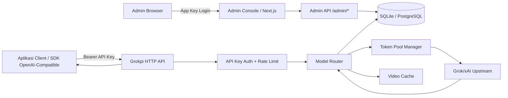
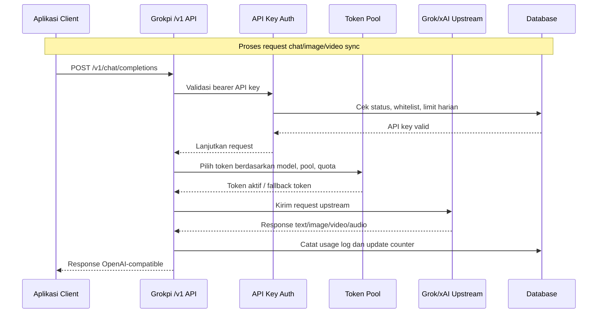
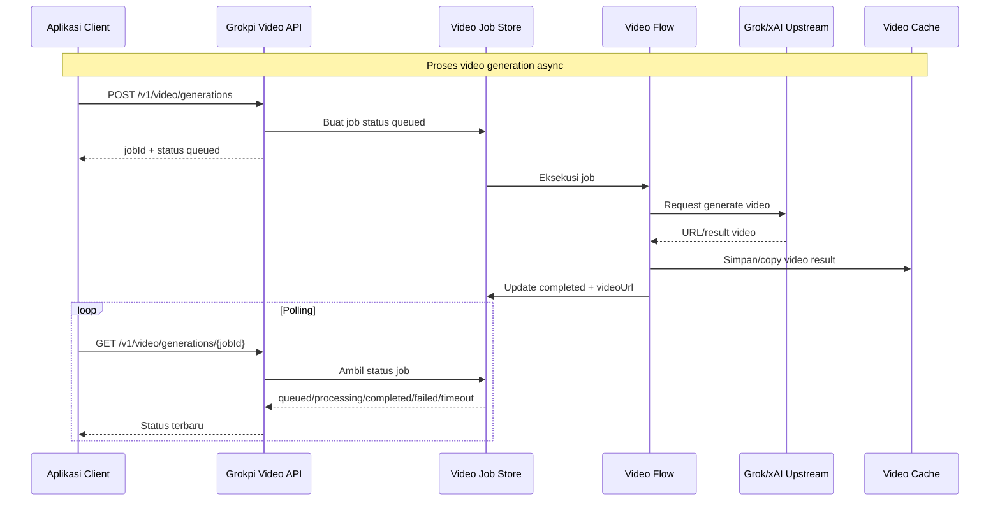
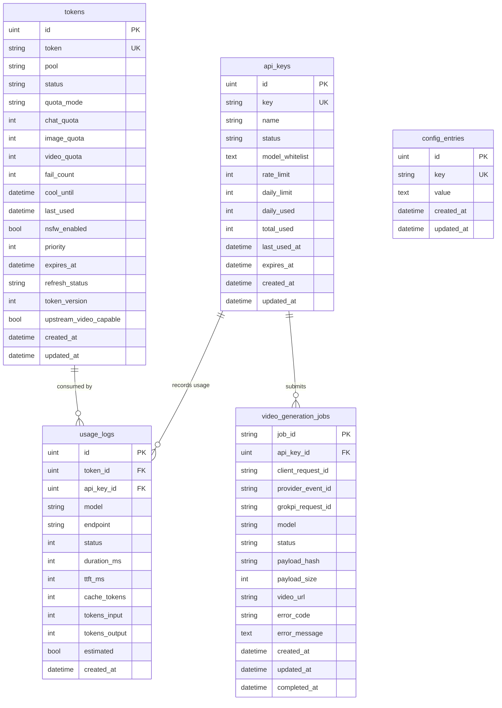

# PRD - Project Requirements Document

## 1. Overview
Grokpi adalah gateway AI self-hosted yang menyediakan API kompatibel OpenAI untuk workload Grok/xAI: chat/LLM, text-to-image, image edit, text-to-video, image-to-video, dan text-to-speech. Sistem ini menjadi satu pintu bagi aplikasi MASJAVAS atau client lain agar tidak perlu langsung mengelola token upstream, retry, quota, cache media, atau perbedaan format response dari provider.

Masalah utama yang diselesaikan adalah kebutuhan akses model Grok yang stabil, terukur, dan mudah diintegrasikan melalui endpoint standar seperti `/v1/models`, `/v1/chat/completions`, `/v1/audio/speech`, dan async video generation. Grokpi juga menyediakan Admin Console untuk mengelola token pool, API key, whitelist model, usage log, konfigurasi runtime, dan cache file video.

Tujuan utama produk adalah menyediakan platform gateway AI yang ringan untuk self-hosting di VPS/server, aman untuk produksi kecil-menengah, dan tetap nyaman dipakai oleh developer melalui format OpenAI-compatible.

## 2. Requirements
Berikut adalah persyaratan tingkat tinggi untuk pengembangan dan operasional Grokpi:

- **Aksesibilitas:** API harus dapat diakses melalui HTTP/HTTPS, sementara Admin Console tersedia melalui browser di endpoint aplikasi yang sama.
- **Kompatibilitas API:** Endpoint utama wajib mengikuti pola OpenAI-compatible agar mudah dipakai oleh SDK/client umum.
- **Auth Terpisah:** Admin Console memakai `app_key`, sedangkan endpoint `/v1/*` memakai API key per aplikasi/client.
- **Token Pool:** Sistem harus dapat mengelola token upstream Grok/xAI dalam pool Basic dan Super, termasuk status aktif, disabled, cooling, expired, quota exhausted, dan refresh required.
- **Quota dan Rate Limit:** API key dan token harus memiliki batas rate limit, daily limit, quota chat/image/video, serta pencatatan penggunaan.
- **Media Generation:** Sistem harus mendukung text-to-image, image edit, video generation sync/async, cache video, dan TTS.
- **Observability:** Admin harus dapat melihat health, status sistem, usage log, quota/token stats, dan cache stats.
- **Deployment:** Sistem harus dapat dijalankan sebagai single Go binary dengan embedded web app, Docker Compose, SQLite default, dan opsi PostgreSQL.
- **Security:** Rahasia seperti upstream token, API key, cookie, dan `config.toml` tidak boleh terekspos di log, dokumen publik, atau frontend client.

## 3. Core Features
Fitur-fitur kunci yang harus ada dan dipertahankan dalam produk:

1. **OpenAI-Compatible Gateway**
   - `GET /v1/models` untuk daftar model yang tersedia berdasarkan token pool dan whitelist API key.
   - `POST /v1/chat/completions` untuk chat, reasoning, tool calling, image generation, image edit, dan video sync.
   - Response chat mengikuti format `chat.completion` dan stream SSE mengikuti format chunk.

2. **Admin Console**
   - Login berbasis `app_key`.
   - Dashboard status sistem, token, quota, usage, dan health.
   - Manajemen settings runtime dari UI.

3. **Token Pool Management**
   - Tambah, batch import, edit, delete, replace, reset usage, sync quota, refresh, dan revalidate token.
   - Pemilihan token berdasarkan pool, quota, status, priority, cooldown, dan algoritma konfigurasi.
   - Video capability test untuk token yang digunakan pada model video.

4. **API Key Management**
   - Create, list, update, delete, dan regenerate API key.
   - Model whitelist per API key.
   - Rate limit, daily limit, expiry, daily used, total used, dan last used tracking.

5. **Image, Video, dan TTS**
   - Image generate melalui `grok-imagine-1.0` dan `grok-imagine-1.0-fast`.
   - Image edit melalui `grok-imagine-1.0-edit` dengan minimal satu `image_url`.
   - Video sync via chat completions dan video async via `/v1/video/generations`.
   - TTS OpenAI-style melalui `/v1/audio/speech` dan alias probe `/audio/speech`.

6. **Async Video Job Manager**
   - Submit job video, simpan status `queued`, `processing`, `completed`, `failed`, atau `timeout`.
   - Polling status dan endpoint result.
   - Simpan metadata seperti `job_id`, `api_key_id`, `model`, `payload_hash`, `video_url`, error code, dan timestamps.

7. **Usage, Cache, dan File Serving**
   - Usage log untuk model, endpoint, status, durasi, TTFT, cache tokens, input/output tokens, dan API key.
   - Cache stats, cache file table, delete selected files, clear cache.
   - Public serving video cache melalui `/api/files/video/{name}`.

## 4. User Flow
Alur kerja utama untuk Admin dan aplikasi client:

1. **Setup Admin**
   - Operator deploy Grokpi di VPS/server.
   - Operator mengatur `config.toml`, `app_key`, database path, host, port, dan opsi proxy bila dibutuhkan.
   - Operator login ke Admin Console melalui browser.

2. **Setup Token dan API Key**
   - Admin menambahkan upstream token ke pool Basic/Super.
   - Admin menjalankan sync quota, revalidate, atau video capability test jika diperlukan.
   - Admin membuat API key untuk aplikasi client dan mengatur whitelist model/rate limit/daily limit.

3. **Integrasi Aplikasi Client**
   - Client menyimpan `GROKPI_BASE_URL` dan `GROKPI_API_KEY` di environment server-side.
   - Client memanggil `GET /v1/models` untuk sinkronisasi model.
   - Client memilih model sesuai task: chat, image, image edit, video, atau TTS.

4. **Request AI**
   - Client mengirim request ke `/v1/chat/completions`, `/v1/video/generations`, atau `/v1/audio/speech`.
   - Grokpi memvalidasi API key, whitelist model, payload, rate limit, dan quota.
   - Grokpi memilih token upstream yang sesuai, meneruskan request, lalu mengubah response menjadi format yang kompatibel.

5. **Monitoring dan Operasi**
   - Admin memantau usage, quota, token health, API key usage, dan cache.
   - Jika token kena rate limit/cooling/quota exhausted, Admin dapat melakukan refresh, replace, atau menambah token baru.
   - Untuk video async, client polling status sampai `completed` atau gagal.

## 5. Architecture
Berikut gambaran arsitektur sistem dan aliran data secara teknis namun sederhana.

## 6. Database Schema
Berikut Entity Relationship Diagram (ERD) utama berdasarkan model storage Grokpi.

| Tabel | Deskripsi |
|-------|-----------|
| **api_keys** | Menyimpan API key client, status, whitelist model, rate limit, daily limit, usage counter, dan expiry. |
| **tokens** | Menyimpan token upstream Grok/xAI beserta pool, status, quota chat/image/video, cooldown, refresh metadata, dan video capability. |
| **usage_logs** | Log request API untuk observability: model, endpoint, status, durasi, token usage, API key, dan token upstream. |
| **video_generation_jobs** | Lifecycle job video async: queued/processing/completed/failed/timeout, metadata request, URL hasil, dan error. |
| **config_entries** | Konfigurasi runtime yang disimpan di database melalui Admin Console. |

## 7. Design & Technical Constraints
Bagian ini mengatur batasan teknis dan panduan desain yang harus dipatuhi dalam pengembangan Grokpi.

1. **High-Level Technology**
   - Backend utama menggunakan Go 1.24+ dengan `chi` router, GORM, SQLite default, dan opsi PostgreSQL.
   - Frontend Admin Console menggunakan Next.js 15, React 19, TypeScript, TanStack Query, dan komponen UI lokal.
   - Build produksi menghasilkan single Go binary dengan web app ter-embed.
   - Deployment resmi harus mendukung Docker Compose dan self-hosted VPS.

2. **API Compatibility**
   - Endpoint `/v1/*` harus mempertahankan shape response OpenAI-compatible.
   - Error response harus stabil dengan `error.code` yang bisa dipakai client untuk UX dan retry handling.
   - Field custom seperti `image_config` dan `video_config` tidak boleh merusak payload chat standar.

3. **Security Rules**
   - Admin auth dan API auth wajib dipisah.
   - API key harus disamarkan di response list/detail, kecuali saat create/regenerate.
   - Upstream token tidak boleh dikirim ke frontend publik atau tercatat utuh di log.
   - Public deployment harus memakai HTTPS/reverse proxy dan menjaga `config.toml` tetap privat.

4. **Reliability and Quota**
   - Token selection harus memperhitungkan pool, model availability, quota, status, cooldown, priority, dan fallback.
   - Request yang gagal karena upstream/rate limit harus menghasilkan status token yang dapat diaudit.
   - Video generation long-running sebaiknya memakai async job untuk menghindari blocking request.

5. **Observability**
   - Setiap request yang melewati gateway harus dapat dicatat ke usage log tanpa membocorkan rahasia.
   - Admin Console harus menampilkan status sistem, usage, token health, quota, dan cache.
   - Health endpoint `/health` dan `/healthz` harus tetap tanpa auth untuk probe deployment.

6. **Frontend Design**
   - Admin Console harus bersifat operasional: padat, mudah discan, dan fokus pada tindakan admin seperti create key, update token, sync quota, clear cache, dan review usage.
   - UI harus menghindari elemen dekoratif berlebihan; dashboard dan tabel harus mengutamakan readability, status badge, filter, dan aksi yang jelas.
   - Form sensitif seperti token/API key/config harus memakai input yang aman dan memberi feedback validasi.

7. **Operational Constraints**
   - Minimal target ringan: 2 vCPU / 2 GB RAM untuk penggunaan kecil.
   - SQLite cocok untuk single-node deployment; PostgreSQL dapat dipakai untuk kebutuhan operasional lebih besar.
   - Backup wajib mencakup `data/` dan `config.toml`.
   - Cache video harus dapat dibersihkan dari Admin Console untuk mengontrol penggunaan disk.
