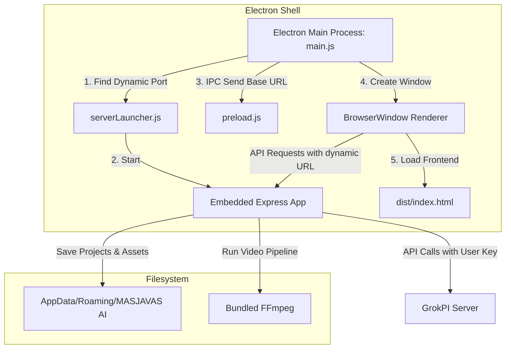

# Implementation Plan — MASJAVAS AI Desktop Windows Build

Rencana pemindahan, pembungkusan, dan pengamanan MASJAVAS AI menjadi aplikasi desktop Windows (*production-ready*) menggunakan kombinasi **Electron**, **electron-builder**, embedded **Express backend**, dan **FFmpeg bundled**.

---

## 1. Arsitektur Desktop Windows

Aplikasi desktop akan dijalankan menggunakan arsitektur proses ganda (Main Process + Renderer Process) yang terintegrasi dengan server Express lokal di latar belakang.

### A. Komponen Utama Desktop:
1. **`desktop/main.js` (Main Process)**:
   * Mengatur daur hidup aplikasi Electron (`app.on('ready')`, dll.).
   * Menjalankan embedded Express server pada port dinamis localhost.
   * Menampilkan splash screen selama backend melakukan inisialisasi.
   * Membuka jendela utama (`BrowserWindow`) beraksen gelap premium tanpa terminal luar.
2. **`desktop/serverLauncher.js` (Server Manager)**:
   * Menggunakan modul `get-port` untuk mencari port bebas pada range [3000, 3001, 3002, 3010, 0] di alamat lokal `127.0.0.1`.
   * Menginisialisasi jalur penyimpanan runtime berbasis Roaming AppData.
3. **`desktop/preload.js` (API Bridge)**:
   * Menjaga keamanan renderer dengan `contextIsolation: true` dan `nodeIntegration: false`.
   * Mengekspos jembatan aman `window.masjavas` berisi metode `getApiBaseUrl()` dan properti `platform`.

---

## 2. Rencana Perubahan Backend (Phase A & E & F)

Untuk mendukung eksekusi desktop tanpa modifikasi masif pada kode dasar MVP, kami membagi server entry point dan membuat pemetaan penyimpanan dinamis.

### A. Komponen Baru & Pemisahan Entry Point:
- **[NEW] `server/app.js`**:
  Mengekspor fungsi `createApp(runtimeConfig)`. Berisi deklarasi instansi Express, CORS dinamis, *static serving* `/uploads` dan `/exports` dari direktori runtime AppData, serta mounting semua routes.
- **[MODIFY] `server/index.js`**:
  Hanya digunakan untuk mode dev/server biasa. Membaca `PORT` default 3000 dari `.env`, mengimpor `createApp`, dan memanggil `app.listen(PORT)`.
- **[NEW] `server/utils/runtimePaths.js`**:
  Singleton yang mendistribusikan jalur penyimpanan ke seluruh server:
  * `projectsDir`: `%APPDATA%/MASJAVAS AI/data/projects`
  * `uploadsDir`: `%APPDATA%/MASJAVAS AI/uploads`
  * `exportsDir`: `%APPDATA%/MASJAVAS AI/exports`
  * `tempDir`: `%APPDATA%/MASJAVAS AI/temp`
  * `logsDir`: `%APPDATA%/MASJAVAS AI/logs`
  * *Fallback Dev*: Menggunakan subfolder `server/data`, `server/uploads`, dan `server/exports` di folder proyek jika di luar mode desktop.
- **[NEW] `server/utils/ffmpegResolver.js`**:
  Menyelesaikan jalur executable `ffmpeg.exe` dan `ffprobe.exe`. Jika mode packaged (`MASJAVAS_DESKTOP_PACKAGED === "true"`), menunjuk ke subfolder resources `process.resourcesPath/ffmpeg/win32/`. Jika dev, menggunakan binari system PATH default.

### B. Modifikasi File Server untuk Runtime Paths & FFmpeg:
* **[MODIFY] [projectRepository.js](file:///c:/Users/Masjavas/Documents/APLIKASI%20MASJAVAS%20FILM%20V5/server/services/projectRepository.js)**: Menggunakan `getRuntimePaths().projectsDir` secara dinamis.
* **[MODIFY] [exportJobService.js](file:///c:/Users/Masjavas/Documents/APLIKASI%20MASJAVAS%20FILM%20V5/server/services/exportJobService.js)**: Menggunakan `getRuntimePaths().exportsDir` dan `getRuntimePaths().tempDir`.
* **[MODIFY] [exportService.js](file:///c:/Users/Masjavas/Documents/APLIKASI%20MASJAVAS%20FILM%20V5/server/services/exportService.js)**: Menggunakan `getRuntimePaths().exportsDir` dan `getRuntimePaths().tempDir`.
* **[MODIFY] [grokpiClient.js](file:///c:/Users/Masjavas/Documents/APLIKASI%20MASJAVAS%20FILM%20V5/server/services/grokpiClient.js)**: Resolusi path lokal file upload dan ekspor mematuhi `getRuntimePaths()`. Dynamic read `GROKPI_API_KEY` dari Settings.
* **[MODIFY] [referenceService.js](file:///c:/Users/Masjavas/Documents/APLIKASI%20MASJAVAS%20FILM%20V5/server/services/referenceService.js)**: Menggunakan `getRuntimePaths().uploadsDir`.
* **[MODIFY] [sceneService.js](file:///c:/Users/Masjavas/Documents/APLIKASI%20MASJAVAS%20FILM%20V5/server/services/sceneService.js)**: Menggunakan `getRuntimePaths().uploadsDir`.
* **[MODIFY] [upload.js](file:///c:/Users/Masjavas/Documents/APLIKASI%20MASJAVAS%20FILM%20V5/server/middleware/upload.js)**: Konfigurasi `multer.diskStorage` diubah agar mengevaluasi tujuan `uploadsDir` secara dinamis saat *request* terjadi.
- **[NEW] [settingsService.js](file:///c:/Users/Masjavas/Documents/APLIKASI%20MASJAVAS%20FILM%20V5/server/services/settingsService.js)**: Mengelola penyimpanan stempel API key GrokPI dan base URL ke berkas JSON `%APPDATA%/MASJAVAS AI/config.json`.
- **[NEW] [settingsRoutes.js](file:///c:/Users/Masjavas/Documents/APLIKASI%20MASJAVAS%20FILM%20V5/server/routes/settingsRoutes.js)**: Endpoint REST `/api/settings` (GET & POST) dengan masking sensor keamanan.

---

## 3. Rencana Perubahan Frontend (Phase D & H)

* **[NEW] [apiBase.ts](file:///c:/Users/Masjavas/Documents/APLIKASI%20MASJAVAS%20FILM%20V5/src/services/apiBase.ts)**:
  Fungsi `getApiBaseUrl()` untuk membaca `window.masjavas.getApiBaseUrl()` jika desktop mode aktif, atau `import.meta.env.VITE_API_BASE_URL` jika web-mode.
* **[MODIFY] Frontend Services**: Ubah `exportService.ts`, `projectService.ts`, `referenceService.ts`, dan `sceneService.ts` untuk menggunakan `getApiBaseUrl()` sebagai basis pemanggilan.
* **[MODIFY] [SettingsPage.tsx](file:///c:/Users/Masjavas/Documents/APLIKASI%20MASJAVAS%20FILM%20V5/src/pages/SettingsPage.tsx)**:
  Menambahkan formulir input `GrokPI API Key` dan `GrokPI Base URL` dengan enkripsi masukan (password field) dan status simpan.

---

## 4. Keamanan & Rahasia Kunci (Security & Secrets)

1. **Anti-Leakage**: Kunci API developer (`GROKPI_API_KEY`) asli tidak akan dibundle di kode sumber maupun file `.env` installer.
2. **First-Launch Gate**: Jika kunci tidak dikonfigurasi saat pertama kali aplikasi dibuka di desktop, Express server tidak akan mengalami *crash* instan. Aplikasi akan tetap berjalan, dan user diarahkan untuk menginputkan API key mereka sendiri di halaman Pengaturan (Settings).
3. **Log Sanitization**: Melarang *logging* API key atau header otorisasi ke berkas logs AppData.

---

## 5. Visual Branding & Installer Packaging (Phase G & I)

1. **Aset Aset Premium**:
   * Membuka jembatan desain visual premium untuk logo/ikon rounded-square modern gradasi biru-cyan-violet (`resources/icon.ico`).
   * Mendesain spanduk *Splash Screen* (`resources/branding/splash.png`) dengan label teks: `"MASJAVAS AI sedang menyiapkan workspace..."` menggunakan micro-animation breathing.
2. **Bundling FFmpeg**:
   * Menyalin binari fisik `ffmpeg.exe` dan `ffprobe.exe` ke folder resources `resources/ffmpeg/win32/`.
3. **Packaging Setup**:
   * Konfigurasi script `package.json` untuk `desktop:dev` (menjalankan concurrently + wait-on), `desktop:pack` (unpacked test), dan `desktop:build` (build installer).
   * Konfigurasi `electron-builder` NSIS installer dengan parameter shortcut Desktop & Start Menu, kustomisasi ikon, penentuan direktori instalasi, dan bundle `extraResources` untuk FFmpeg dan aset.

---

## 6. Rencana Verifikasi (Verification Plan)

### Automated Checks:
1. `npx tsc --noEmit` & `npm run build`
2. `node scratch/ffmpeg_smoke_test.js`

### Manual Desktop Checks:
1. Menjalankan `npm run desktop:pack` untuk membuat versi unpacked di folder `release/win-unpacked`.
2. Menjalankan aplikasi unpacked tanpa menggunakan terminal eksternal.
3. Membuka halaman Settings dan mencoba memasukkan/menyimpan API Key GrokPI baru.
4. Membuat proyek cerita baru, mengunduh referensi otomatis, dan merender video adegan.
5. Mematikan aplikasi dan memverifikasi tidak ada proses Node/Electron yang tersangkut di Task Manager.
6. Membangun installer NSIS dan memverifikasi kelancaran pemasangan aplikasi.
