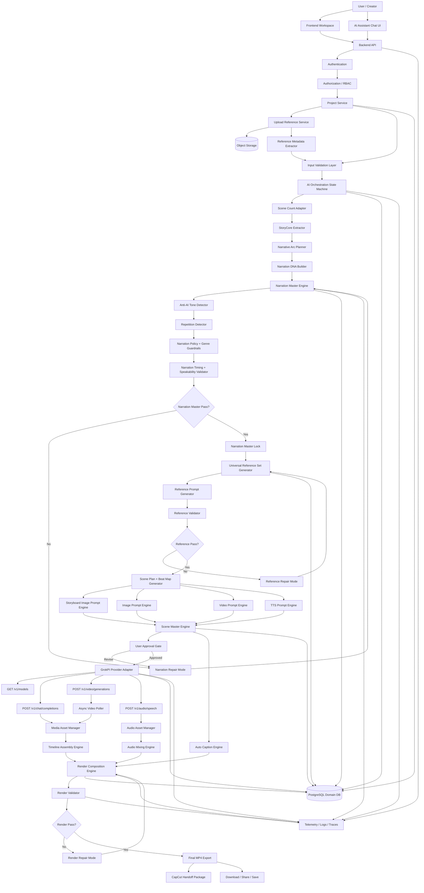
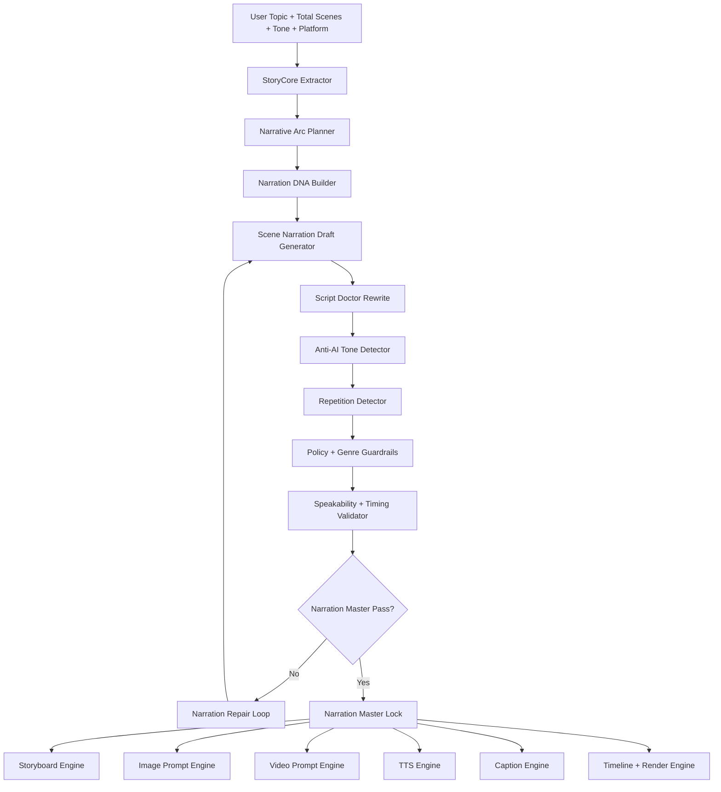
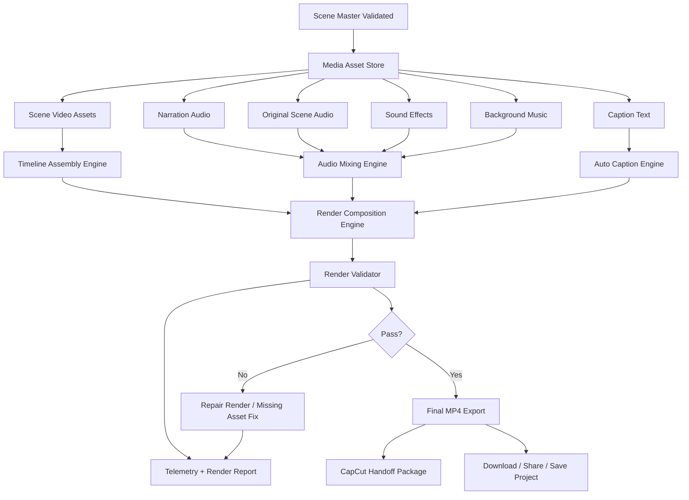
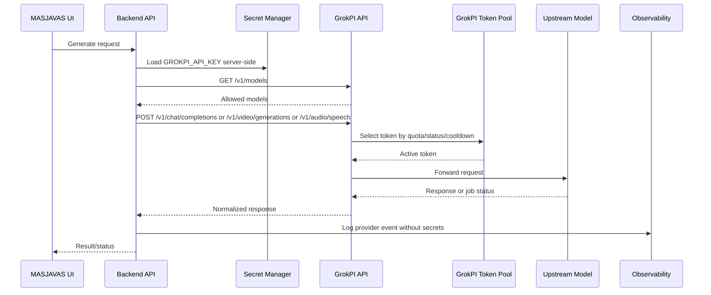

# PRD — MASJAVAS AI Cinematic Production & Post-Production Operating System

## Version
v2.0 — Narration-First + Scene-Count-First + Reference Lock + Timeline Render Engine

---

## Intake Summary

| Pertanyaan | Jawaban User | Implikasi Produk |
|---|---|---|
| 1. User sekarang menyelesaikan masalahnya dengan cara apa? | Banyak aplikasi terpisah | Produk harus menyatukan workflow ide, referensi, narasi, prompt, video, audio, subtitle, timeline, dan render. |
| 2. Saat pertama kali buka aplikasi, user harus berhasil melakukan apa? | Buat proyek / konten / data pertama | Activation moment adalah user berhasil membuat project pertama dan menerima draft produksi awal. |
| 3. Fitur paling wajib untuk MVP? | Generate AI, AI Assistant/Chatbot, Upload file/gambar/dokumen untuk referensi tokoh/karakter manual | MVP harus memiliki project workspace, upload reference, AI assistant, generation pipeline, dan reference lock. |
| 4. Apa keunggulan dibanding cara lama? | Hasil lebih profesional | Sistem harus menghasilkan narasi, visual, audio, caption, timeline, dan render yang lebih cinematic dan konsisten. |
| 5. Kenapa user akan balik lagi? | Bisa dipakai rutin dan menghemat waktu | Retention loop wajib berbasis project history, reusable references, saved style, template, render history, dan learning loop. |

---

## Product Doctrine

```txt
NARASI ADALAH NYAWA PRODUK.

MASJAVAS tidak boleh membuat storyboard, image prompt, video prompt, TTS, caption, timeline, atau final render sebelum Narration Master lolos validasi.

User memilih total scene.
Setiap scene default = 10 detik.
Total durasi = totalScene × 10 detik.
Ide dikonversi ke jumlah scene yang diminta user.
Semua video, audio, caption, dan timeline mengikuti scene plan tersebut.
```

---

## Final Product Contract

```txt
MASJAVAS = AI Cinematic Production + Post-Production Operating System
GrokPI = Primary AI Provider Gateway

USER FIRST SUCCESS = Create first project/content
CORE INPUTS = Topic + Total Scenes + Tone + Platform + Mode + References
CORE MVP = Upload Reference + AI Assistant + Narration Master + Generate AI Pipeline + Timeline Render + Export Package
VALUE = Professional cinematic output
RETENTION = Routine use + time saving + reusable references + project history + render history

NO TOTAL SCENE → NO DURATION
NO STORYCORE → NO NARRATIVE ARC
NO NARRATIVE ARC → NO NARRATION DNA
NO NARRATION DNA → NO SCENE NARRATION
NO NARRATION MASTER PASS → NO STORYBOARD
NO NARRATION MASTER PASS → NO IMAGE PROMPT
NO NARRATION MASTER PASS → NO VIDEO PROMPT
NO NARRATION TIMING PASS → NO TTS
NO REFERENCE VALIDATION → NO VIDEO PROMPT
NO SCENE VIDEO ASSET → NO TIMELINE
NO AUDIO SYNC PASS → NO RENDER
NO CAPTION SYNC PASS → NO FINAL EXPORT
NO RENDER VALIDATION PASS → NO DOWNLOAD FINAL
NO GROKPI MODEL SYNC → NO PROVIDER ROUTING
NO SECRET MANAGER → NO PRODUCTION DEPLOYMENT
```

---

# 1. Overview

## 1.1 Ringkasan Produk

MASJAVAS AI adalah **AI-native cinematic production and post-production operating system** yang membantu creator mengubah satu ide menjadi film/video final siap render. Sistem ini tidak berhenti di prompt atau scene package, tetapi menyelesaikan seluruh alur produksi:

```txt
Ide
→ StoryCore
→ Narrative Arc
→ Narration Master
→ Reference Set
→ Scene Plan
→ Storyboard
→ Image Prompt
→ Video Prompt
→ TTS / Audio
→ Scene Video
→ Caption
→ Timeline Assembly
→ Audio Mixing
→ Render Final
→ Export Package
```

Produk ini menggantikan workflow manual yang biasanya dilakukan dengan banyak aplikasi: riset, nulis narasi, membuat prompt, generate video, generate audio, masuk CapCut, susun scene, sync narasi, tambah SFX, tambah subtitle, dan render final.

GrokPI menjadi **primary AI provider gateway** untuk model orchestration, text generation, image generation, image editing, video generation, image-to-video, TTS, quota, model routing, token pool, async job, usage logs, dan provider operations.

## 1.2 Masalah Utama

User saat ini memakai banyak aplikasi terpisah untuk membuat video AI. Masalah utamanya:

1. Ide, narasi, prompt, referensi, video, audio, dan subtitle tersebar di banyak tool.
2. Narasi sering terasa seperti AI: repetitif, generik, terlalu menjelaskan visual, moralizing, atau tidak cinematic.
3. Karakter, wajah, kostum, lokasi, dan visual style sering berubah antar scene.
4. Prompt image dan prompt video tercampur.
5. Durasi scene tidak konsisten.
6. Audio narasi, audio video asli, SFX, dan musik harus disusun manual.
7. Subtitle/caption harus dibuat dan disinkronkan manual.
8. User masih harus memakai CapCut untuk menggabungkan scene menjadi satu render final.
9. Tidak ada validation gate sebelum output buruk masuk tahap render.
10. Tidak ada observability atas provider, asset, timeline, audio sync, caption sync, dan render failure.

## 1.3 Target User

| Segment | Problem | Primary Need |
|---|---|---|
| AI video creator | Banyak tool, output tidak konsisten | End-to-end workflow dari ide ke final render |
| YouTube documentary creator | Narasi harus kuat dan cinematic | Narration-first pipeline, source discipline, scene timing |
| Short-form creator | Butuh produksi cepat dan hook kuat | Scene-count-first, 10s scene, fast render |
| AI video producer | Karakter/lokasi drift | Universal Reference Set + Reference Lock |
| Creative agency kecil | Harus kirim output profesional ke klien | Project workspace, approval, render package |
| Solo creator | Tidak punya editor/post-production team | AI assistant + auto timeline + auto render |

## 1.4 Business Objective

Membangun SaaS/workflow engine yang:

- Mengurangi ketergantungan pada banyak aplikasi terpisah.
- Menjadikan narasi sebagai kualitas utama produk.
- Menghasilkan video AI yang lebih profesional, konsisten, dan siap render.
- Mengotomatiskan kerja editing dasar yang biasanya dilakukan di CapCut.
- Menyediakan reusable reference, style, narration DNA, dan project template untuk pemakaian rutin.
- Membuka monetisasi melalui subscription, generation quota, render quota, storage, dan premium post-production tools.

## 1.5 Success Definition

Produk dianggap berhasil jika user dapat membuat project pertama, mengunci narasi, menghasilkan scene, menyusun timeline otomatis, dan mendapatkan final render tanpa harus menggabungkan manual di aplikasi lain.

| Metric | MVP Target |
|---|---:|
| Project activation rate | ≥ 75% |
| User mencapai Narration Master Lock | ≥ 70% |
| Time to first draft package | ≤ 10 menit |
| Time to first draft render | ≤ 30 menit untuk project pendek |
| Human-like narration score | ≥ 95 |
| Narration repetition score | ≥ 95 |
| Narration speakability score | ≥ 95 |
| Scene count accuracy | 100% |
| Scene duration accuracy | 100% scene = 10 detik |
| Reference consistency pass rate | ≥ 95% |
| Timeline assembly success | ≥ 95% |
| Audio sync pass rate | ≥ 95% |
| Caption sync pass rate | ≥ 95% |
| Render success rate | ≥ 95% |
| User-rated professional quality | ≥ 4/5 |
| Weekly repeat usage | ≥ 35% beta users |
| Safety violation rate | ≤ 0.5% |
| Secret leakage incident | 0 |

## 1.6 MVP Scope

MVP wajib mencakup:

1. Authentication + workspace.
2. Project creation berbasis TOPIC, TOTAL_SCENES, TONE, PLATFORM, MODE.
3. Upload file/gambar/dokumen untuk reference tokoh, karakter, style, lokasi, dan source.
4. AI Assistant / Project Copilot.
5. StoryCore Extractor.
6. Scene Count Adapter.
7. Narrative Arc Planner.
8. Narration DNA Builder.
9. Narration Master Engine.
10. Narration Quality Validator.
11. Universal Reference Set Generator.
12. Reference Prompt Generator.
13. Reference Validator.
14. Scene Plan + Beat Map Generator.
15. Storyboard Image Prompt Engine.
16. Image Prompt Engine.
17. Video Prompt Engine.
18. TTS Prompt / Audio Direction Engine.
19. Scene Master Engine.
20. GrokPI Provider Adapter.
21. Scene Video Asset Manager.
22. Auto Caption Engine.
23. Audio Mixing Engine.
24. Timeline Assembly Engine.
25. Render Composition Engine.
26. Render Validator.
27. Final MP4 Export.
28. CapCut Handoff Package.
29. Observability, audit logs, fallback, repair mode.

## 1.7 Out-of-Scope Awal

Tidak masuk MVP awal:

- Marketplace template publik.
- Direct publishing ke YouTube/TikTok/Instagram.
- Full collaborative editing seperti CapCut desktop.
- Advanced motion graphics editor.
- Multi-user enterprise approval kompleks.
- Advanced social analytics.
- Full legal/factual claim automation tanpa human review.
- Public multi-provider switching UI.
- Fully autonomous publishing tanpa user approval.

---

# 2. Requirements

## 2.1 Requirement Table

| ID | Requirement | Priority | Owner | Acceptance Criteria |
|---|---|---:|---|---|
| REQ-001 | User dapat login/register dan membuat workspace. | Must | Engineering | User dapat masuk, session aman, workspace dibuat. |
| REQ-002 | User dapat membuat project dari TOPIC, TOTAL_SCENES, TONE, PLATFORM, MODE. | Must | Product | Project tersimpan; total duration dihitung otomatis = totalScenes × 10. |
| REQ-003 | Sistem menggunakan total scene sebagai input utama, bukan durasi bebas. | Must | Product | Jika user memilih 30 scene, sistem menghasilkan 30 scene × 10 detik. |
| REQ-004 | Setiap scene default berdurasi 10 detik. | Must | System | SceneDurationValidator pass 100%. |
| REQ-005 | User dapat upload file/gambar/dokumen sebagai referensi karakter, tokoh, lokasi, style, source. | Must | Product/Engineering | File tervalidasi, tersimpan, dan dapat dipakai Reference Set. |
| REQ-006 | AI Assistant dapat membantu user menyusun brief, memperbaiki narasi, menjalankan repair, dan menjelaskan validation. | Must | AI/Product | Assistant project-aware dan tidak bisa bypass gate. |
| REQ-007 | StoryCore Extractor mengekstrak characters, opposing forces, world, object affordances, story moments, dan scene intent. | Must | AI | StoryCore completeness ≥ 95 sebelum Narrative Arc. |
| REQ-008 | Narrative Arc Planner membagi cerita sesuai total scene. | Must | AI | Setiap scene punya narrative function. |
| REQ-009 | Narration DNA Builder membuat style suara narator sebelum narasi scene. | Must | AI | Narration DNA approved/locked sebelum scene narration. |
| REQ-010 | Narration Master Engine membuat narasi per scene yang human-like, cinematic, tidak repetitif, dan timing-safe. | Must | AI/Narration | Human-like ≥ 95, repetition ≥ 95, speakability ≥ 95. |
| REQ-011 | Narasi wajib lolos sebelum storyboard/prompt/video/audio/caption/render dibuat. | Must | Workflow | Downstream phase diblokir jika Narration Master belum pass. |
| REQ-012 | Narasi tidak boleh hanya mendeskripsikan visual. | Must | Narration | Visual-description score berada di bawah threshold. |
| REQ-013 | Narasi harus mulai tepat detik 2.0 per scene. | Must | Audio/Timing | AudioStartValidator pass 100%. |
| REQ-014 | Dialog hanya boleh setelah 5.5 detik. | Must | Audio/Timing | DialogueTimingValidator pass 100%. |
| REQ-015 | Universal Reference Set dibuat otomatis dari StoryCore, bukan hardcoded template. | Must | AI/Reference | Reference set 6–8 item dibuat dari StoryCore. |
| REQ-016 | Reference set mendukung PrimaryCharacterRef, AlternateStateCharacterRef, SupportingCharacterRef, OpposingForceRef, GroupOrInstitutionRef, PropRef, CreatureRef, EnvironmentRef. | Must | AI/Reference | Role coverage pass. |
| REQ-017 | Character reference hanya untuk identity lock. | Must | Media | ReferenceRoleValidator pass. |
| REQ-018 | Storyboard reference hanya untuk struktur visual dan flow. | Must | Media | Tidak ada storyboard grid/panel/text di video prompt. |
| REQ-019 | Environment reference hanya untuk lokasi, lighting, material, mood. | Must | Media | Environment role compliance pass. |
| REQ-020 | Previous video reference hanya untuk continuity. | Must | Media | Previous video tidak membuat story restart. |
| REQ-021 | Scene Plan wajib memiliki beat map 0–10 detik. | Must | Scene Engine | Semua scene memiliki 5 beat standar. |
| REQ-022 | Beat map standar: 0–2 visual hook, 2–5.5 narration, 5.5–7 dialogue/reaction, 7–8.8 emotional detail, 8.8–10 transition. | Must | Scene Engine | BeatMapValidator pass. |
| REQ-023 | Image Prompt dan Video Prompt wajib dipisahkan. | Must | Media | Image/video separation = 100%. |
| REQ-024 | Video Prompt membuat 10-second event, bukan deskripsi gambar statis. | Must | Media | Motion and timing metadata complete. |
| REQ-025 | TTS Prompt mengikuti Narration DNA, timing, pause, emotion, dan pacing. | Must | Audio | TTS readiness ≥ 95. |
| REQ-026 | GrokPI menjadi provider utama untuk text, image, image edit, video, image-to-video, TTS. | Must | Platform | Adapter mendukung endpoint utama. |
| REQ-027 | Async video generation dikelola dengan queued, processing, completed, failed, timeout. | Must | Platform | Video job state handling pass. |
| REQ-028 | Scene Video Asset Manager menyimpan dan memvalidasi video per scene. | Must | Media | Semua scene punya asset atau render diblokir. |
| REQ-029 | Timeline Assembly Engine menggabungkan scene video secara urut berdasarkan sceneNumber. | Must | Post-Production | Timeline urut, tidak ada scene hilang. |
| REQ-030 | Audio Mixing Engine menggabungkan narration, original scene audio, dialogue, SFX, dan music. | Must | Post-Production | Audio sync pass; clipping = 0. |
| REQ-031 | Auto Caption Engine membuat SRT/VTT/ASS/JSON dari narration dan dialogue. | Must | Post-Production | Caption sync pass ≥ 95. |
| REQ-032 | Subtitle tidak boleh muncul di raw generated video; subtitle hanya ditambahkan saat final render jika user memilih. | Must | Media/Post | Raw video prompt no visible text; final caption optional. |
| REQ-033 | Render Composition Engine menghasilkan final MP4. | Must | Post-Production | Final duration = totalScenes × 10. |
| REQ-034 | CapCut Handoff Export membuat folder asset terstruktur. | Should | Export | Folder berisi scene videos, audio, subtitles, timeline JSON, manifest. |
| REQ-035 | Export hanya boleh dibuat jika validation pass. | Must | Release | No validation pass = no export. |
| REQ-036 | Semua provider secret disimpan server-side. | Must | Security | Tidak ada API key di frontend, logs, export, PDF. |
| REQ-037 | Semua critical events dicatat. | Must | Reliability | Critical path telemetry coverage = 100%. |
| REQ-038 | Project history dan reusable references tersedia untuk repeat usage. | Should | Product | User bisa reuse character/style/reference di project baru. |
| REQ-039 | Feedback loop menyimpan user rating dan repair signal. | Should | Product/AI | Feedback masuk learning profile. |
| REQ-040 | Prompt/model/provider/render config memiliki rollback switch. | Must | Release | Rollback bisa dilakukan jika threshold gagal. |

---

# 3. Core Features

## 3.1 Project Workspace & Scene-Count-First Project Builder

**Description:**  
Workspace untuk membuat project video berdasarkan jumlah scene, bukan durasi bebas.

**User Story:**  
Sebagai creator, saya ingin memilih jumlah scene agar aplikasi mengubah ide saya menjadi struktur cerita yang sesuai durasi pasti.

**Input:**
- Topic
- Total scenes
- Tone
- Platform
- Mode
- References optional

**Output:**
- Project record
- Total duration
- Pipeline initialized

**Business Rules:**
- Total duration = totalScenes × 10 detik.
- totalScenes minimum dan maksimum mengikuti plan.
- durationPerSceneSec default = 10.

**Edge Cases:**
- User meminta durasi bebas.
- User memilih scene terlalu banyak untuk ide pendek.
- User memilih scene terlalu sedikit untuk cerita kompleks.

**Error States:**
- Invalid totalScenes
- Unsupported platform
- Missing topic

**Acceptance Criteria:**
- [ ] User dapat membuat project pertama.
- [ ] Total duration dihitung otomatis.
- [ ] Pipeline menampilkan jumlah scene dan target durasi final.

---

## 3.2 Upload Reference File / Image / Document

**Description:**  
Upload referensi tokoh, karakter, wajah, kostum, lokasi, style, dokumen source, dan moodboard.

**User Story:**  
Sebagai AI video producer, saya ingin upload reference agar karakter dan visual tidak berubah antar scene.

**Input:**
- Image reference
- Document/source file
- Character note
- Location/style reference

**Output:**
- Stored reference asset
- Reference metadata
- Candidate role assignment

**Business Rules:**
- File harus divalidasi tipe, ukuran, permission, dan safety.
- Reference harus dikaitkan ke project.
- Sensitive content harus dimasking bila masuk model call.

**Edge Cases:**
- Gambar buram.
- Dokumen tidak terbaca.
- Reference bertentangan dengan StoryCore/World Bible.

**Error States:**
- Unsupported file
- Unsafe file
- Low-quality reference
- Permission denied

**Acceptance Criteria:**
- [ ] File berhasil diupload dan diberi label.
- [ ] File bisa dipakai dalam Universal Reference Set.
- [ ] Reference gagal memberi pesan actionable.

---

## 3.3 AI Assistant / Project Copilot

**Description:**  
AI assistant yang membantu user menyusun brief, memperbaiki narasi, menjelaskan validation, dan menjalankan repair.

**User Story:**  
Sebagai creator, saya ingin dibimbing oleh AI agar saya tidak harus memahami semua pipeline teknis.

**Input:**
- User question
- Project state
- Current phase
- Validation report

**Output:**
- Answer
- Repair suggestion
- Next action
- Clarification question

**Business Rules:**
- Assistant tidak boleh bypass gate.
- Assistant harus project-aware dan permission-aware.
- Assistant harus menjelaskan low-confidence state dengan bahasa mudah.

**Edge Cases:**
- User meminta export walau gagal.
- User meminta bypass narasi.
- User memasukkan instruksi ambigu.

**Error States:**
- Low confidence
- Unsafe request
- Permission denied

**Acceptance Criteria:**
- [ ] Assistant dapat menjelaskan status pipeline.
- [ ] Assistant dapat memulai Narration Repair Mode.
- [ ] Assistant tidak dapat melewati validation gate.

---

## 3.4 StoryCore Extractor

**Description:**  
Mengekstrak inti cerita dari topic dan reference user.

**User Story:**  
Sebagai creator, saya ingin ide mentah saya dipahami menjadi struktur cerita yang kuat.

**Input:**
- Topic
- Uploaded references
- Mode
- Platform

**Output:**
- AIExtractedStoryCore

**StoryCore Fields:**
- characters
- protagonist
- opposing forces
- world
- emotional core
- conflict
- transformation
- object affordances
- story moments
- possible scene functions
- risk flags

**Business Rules:**
- StoryCore harus dibuat sebelum Narrative Arc.
- StoryCore tidak boleh hardcode karakter tertentu.
- StoryCore harus universal untuk semua topik.

**Acceptance Criteria:**
- [ ] StoryCore completeness ≥ 95.
- [ ] Semua entity penting diberi ID.
- [ ] Risk flags tercatat.

---

## 3.5 Narrative Arc Planner

**Description:**  
Mengubah StoryCore menjadi struktur cerita sesuai total scene.

**User Story:**  
Sebagai creator, saya ingin ide saya dipecah menjadi alur scene yang proporsional.

**Input:**
- StoryCore
- totalScenes
- tone
- platform

**Output:**
- Narrative Arc Map
- Scene function per scene

**Business Rules:**
- Setiap scene harus punya fungsi naratif.
- Scene tidak boleh repetitif secara fungsi.
- Arc harus punya hook, escalation, turning point, reveal/payoff, closing.

**Acceptance Criteria:**
- [ ] Semua scene punya sceneFunction.
- [ ] Hook dan payoff terhubung.
- [ ] Arc pass sebelum Narration DNA.

---

## 3.6 Narration DNA Builder

**Description:**  
Membuat identitas suara narasi sebelum scene narration dibuat.

**User Story:**  
Sebagai creator, saya ingin narasi memiliki gaya suara yang konsisten, profesional, dan tidak terasa AI.

**Input:**
- StoryCore
- Narrative Arc
- Tone
- Platform
- Audience

**Output:**
- Narration DNA

**Narration DNA Includes:**
- narrator persona
- emotional distance
- moral explicitness
- metaphor level
- sentence length preference
- forbidden words
- preferred vocabulary
- dialogue frequency
- pacing rules
- TTS direction

**Business Rules:**
- Narration DNA wajib locked sebelum scene narration.
- Narration DNA harus menjaga genre consistency.

**Acceptance Criteria:**
- [ ] Narration DNA dibuat dan tersimpan.
- [ ] Avoid words dan preferred words tersedia.
- [ ] TTS direction tersedia.

---

## 3.7 Narration Master Engine

**Description:**  
Engine utama untuk membuat, memperbaiki, menilai, dan mengunci narasi profesional sebelum artefak lain dibuat.

**User Story:**  
Sebagai creator, saya ingin narasi yang terasa ditulis manusia profesional, cinematic, tidak repetitif, tidak melanggar aturan, dan siap dibacakan.

**Input:**
- StoryCore
- Narrative Arc
- Narration DNA
- totalScenes
- platform
- tone

**Output:**
- Scene narration list
- Dialogue policy
- Voice direction
- TTS pacing map
- Narration validation report
- Narration Master Lock

**Business Rules:**
- Narasi dibuat sebelum storyboard, image prompt, video prompt, TTS, caption, timeline, dan render.
- Narasi bukan visual description.
- Narasi harus membawa emosi, subtext, tension, atau meaning.
- Narasi harus human-like.
- Narasi tidak boleh repetitif.
- Narasi harus speakable.
- Narasi harus timing-safe.
- Narasi harus policy-safe.

**Narration Law:**

```txt
1. Narasi bukan deskripsi visual.
2. Narasi harus membawa emosi, makna, atau ketegangan.
3. Satu scene = satu gagasan emosional.
4. Jangan ulang struktur kalimat yang sama lebih dari 2 kali.
5. Jangan ulang kata kunci emosional berlebihan.
6. Jangan gunakan bahasa generik AI.
7. Jangan overdramatic.
8. Jangan menjelaskan yang sudah jelas terlihat di visual.
9. Jangan membuat klaim faktual tanpa source.
10. Jangan membuat dialog jika scene cukup kuat dengan silence.
11. Narasi harus speakable.
12. Narasi harus punya jeda alami.
13. Narasi harus cocok untuk TTS.
14. Narasi harus menjaga rasa penasaran antar scene.
15. Narasi final harus lolos quality score sebelum visual dibuat.
```

**Quality Metrics:**

| Metric | Target |
|---|---:|
| Human-like quality | ≥ 95 |
| Emotional clarity | ≥ 95 |
| Speakability | ≥ 95 |
| Non-repetitive score | ≥ 95 |
| Scene specificity | ≥ 95 |
| Subtext quality | ≥ 90 |
| Genre consistency | 100 |
| Policy/safety pass | 100 |
| Timing fit | ≥ 95 |
| TTS readiness | ≥ 95 |

**Error States:**
- Sounds like AI
- Too repetitive
- Too visual-descriptive
- Too generic
- Too moralizing
- Too long for timing
- Policy violation
- Genre leak

**Acceptance Criteria:**
- [ ] Narration Master Lock hanya dibuat jika semua metric pass.
- [ ] Jika gagal, masuk Narration Repair Mode.
- [ ] Downstream artifact generation diblokir sebelum lock.

---

## 3.8 Anti-AI Tone Detector

**Description:**  
Validator untuk mendeteksi gaya tulisan yang terasa seperti AI.

**Detects:**
- generic phrasing
- repeated structure
- over-explaining
- moral lecture
- unnatural Indonesian
- overdramatic wording
- visual description overload
- template-like sentence
- genre mismatch

**Acceptance Criteria:**
- [ ] Narasi dengan AI-like score tinggi ditolak.
- [ ] Sistem memberi alasan dan contoh perbaikan.
- [ ] Repair loop mengurangi AI-like score.

---

## 3.9 Repetition Detector

**Description:**  
Mendeteksi repetisi kata, struktur, emosi, dan fungsi scene.

**Checks:**
- repeated opening phrase
- repeated emotional word
- repeated sentence pattern
- repeated scene function
- repeated moral statement
- repeated hook device

**Acceptance Criteria:**
- [ ] Repetition score ≥ 95.
- [ ] Repetisi lintas scene ditandai.
- [ ] Repair suggestion tersedia.

---

## 3.10 Narration Timing Validator

**Description:**  
Memastikan narasi cocok dengan scene 10 detik dan mulai detik 2.0.

**Timing Rule:**

```txt
0.0–2.0s = visual hook only
2.0–5.5s = main narration phrase
5.5–7.0s = optional dialogue/reaction
7.0–8.8s = emotional echo / silence / short continuation
8.8–10.0s = transition
```

**Acceptance Criteria:**
- [ ] Narasi tidak mulai sebelum 2.0s.
- [ ] Dialog tidak mulai sebelum 5.5s.
- [ ] Estimated read time cocok dengan timing budget.
- [ ] TTS-ready pacing tersedia.

---

## 3.11 Universal Reference Set Generator

**Description:**  
Membuat 6–8 reference utama otomatis dari StoryCore, bukan dari template hardcoded.

**User Story:**  
Sebagai creator, saya ingin reference tokoh/karakter/objek/lokasi dibuat otomatis sesuai cerita saya.

**Input:**
- AIExtractedStoryCore
- Uploaded references
- Narrative Arc
- Scene Plan

**Output:**
- Universal Reference Set
- Reference prompts
- Validation report

**Reference Roles:**
- PrimaryCharacterRef
- AlternateStateCharacterRef
- SupportingCharacterRef
- OpposingForceRef
- GroupOrInstitutionRef
- PropRef
- CreatureRef
- EnvironmentRef

**Business Rules:**
- Planner memilih maksimal 6–8 reference utama.
- Reference harus berasal dari StoryCore.
- Character reference hanya identity lock.
- Environment reference hanya location/mood/material/lighting lock.
- Storyboard reference hanya struktur visual.
- Previous video reference hanya continuity.

**Acceptance Criteria:**
- [ ] Role coverage pass.
- [ ] Identity lock pass.
- [ ] Provider-ready pass.
- [ ] Tidak ada special-case hardcoded.

---

## 3.12 Reference Prompt Generator

**Description:**  
Membuat prompt image reference untuk character, prop, environment, creature, atau institution/group.

**Input:**
- Universal Reference Item
- World context
- Visual DNA

**Output:**
- Image reference prompt
- Negative prompt
- Usage rule

**Business Rules:**
- Reference prompt tidak boleh menjadi storyboard/action scene.
- CharacterRef wajib full-body reference sheet atau identity sheet.
- EnvironmentRef wajib location/material/lighting/mood lock.
- PropRef wajib object identity and affordance lock.

**Acceptance Criteria:**
- [ ] Prompt sesuai role.
- [ ] Negative prompt tersedia.
- [ ] Usage rules tersedia.

---

## 3.13 Scene Plan & Beat Map Generator

**Description:**  
Membuat scene plan berbasis totalScenes dan Narration Master.

**Input:**
- Narration Master
- Narrative Arc
- totalScenes
- Reference Set

**Output:**
- Scene plan
- Beat map per scene
- Story action per scene

**Business Rules:**
- 1 scene = 10 detik.
- Setiap scene punya 5 beat standar.
- Scene plan mengikuti narasi, bukan sebaliknya.

**Acceptance Criteria:**
- [ ] Semua scene punya beat map.
- [ ] Beat map mengikuti timing rule.
- [ ] Scene plan pass sebelum storyboard.

---

## 3.14 Storyboard Image Prompt Engine

**Description:**  
Membuat prompt storyboard image untuk struktur visual 10 detik per scene.

**Output Format:**
- 1 hero frame utama
- 5 panel kecil berurutan

**Business Rules:**
- Storyboard dipakai sebagai struktur visual, bukan sebagai raw video look.
- Storyboard boleh punya label minimal untuk produksi, tetapi raw video prompt harus melarang visible text.
- Storyboard dibuat setelah Narration Master pass.

**Acceptance Criteria:**
- [ ] Storyboard prompt dibuat per scene.
- [ ] Timing 0–10 detik tercermin.
- [ ] Tidak menjadi final video prompt.

---

## 3.15 Image Prompt Engine

**Description:**  
Membuat keyframe prompt per scene menggunakan Reference Set.

**Business Rules:**
- Image prompt = keyframe, bukan motion event.
- Wajib memakai reference ID.
- Tidak boleh mencampur storyboard labels ke image final.

**Acceptance Criteria:**
- [ ] Image prompt memakai reference ID.
- [ ] Negative prompt tersedia.
- [ ] Reference compliance pass.

---

## 3.16 Video Prompt Engine

**Description:**  
Membuat prompt video sebagai 10-second event dengan motion, camera, timing, audio rule, reference role, dan continuity.

**Video Prompt Must Include:**
- duration 10 seconds
- audio timing rule
- references and role use
- story action
- beat map
- narration
- dialogue if any
- camera
- motion
- sound
- negative

**Business Rules:**
- No narration/dialogue before 2.0s.
- Dialogue only after 5.5s.
- No subtitles or visible text in raw video.
- Previous video only for continuity.
- Video prompt must not show storyboard grid, labels, panels, captions, arrows.

**Acceptance Criteria:**
- [ ] Video prompt per scene generated.
- [ ] Reference role pass.
- [ ] Timing pass.
- [ ] Visible text pass.

---

## 3.17 TTS Prompt & Audio Direction Engine

**Description:**  
Membuat arahan suara untuk narasi, dialog, emotion, pause, pacing, dan pronunciation.

**Input:**
- Narration Master
- Narration DNA
- Scene timing

**Output:**
- TTS prompt
- Voice direction
- Audio timing map

**Acceptance Criteria:**
- [ ] TTS starts at 2.0s per scene.
- [ ] Voice style konsisten.
- [ ] Audio validation score ≥ 95.

---

## 3.18 Scene Master Engine

**Description:**  
Menggabungkan narration, reference, prompt, audio direction, video instruction, dan validation menjadi production sheet per scene.

**Scene Master Includes:**
- sceneNumber
- title
- durationSec = 10
- references
- storyAction
- beatMap
- narration
- dialogue
- camera
- motion
- sound
- imagePrompt
- videoPrompt
- ttsPrompt
- validation

**Acceptance Criteria:**
- [ ] Semua scene punya Scene Master.
- [ ] Scene validation score ≥ 97.
- [ ] Scene gagal masuk Repair Mode.

---

## 3.19 GrokPI Provider Adapter

**Description:**  
Adapter OpenAI-compatible untuk model sync, text/orchestration, image, image edit, video, TTS, async jobs, error mapping, and telemetry.

**Endpoints:**
- GET /v1/models
- POST /v1/chat/completions
- POST /v1/video/generations
- GET /v1/video/generations/{jobId}
- GET /v1/video/generations/{jobId}/result
- POST /v1/audio/speech

**Acceptance Criteria:**
- [ ] Model sync pass.
- [ ] Text generation pass.
- [ ] Video async lifecycle handled.
- [ ] TTS generation pass.
- [ ] Secrets never logged.

---

## 3.20 Scene Video Asset Manager

**Description:**  
Menyimpan, mengelola, dan memvalidasi video per scene.

**Input:**
- Generated scene video
- Scene metadata
- Provider result

**Output:**
- Scene video asset
- Asset manifest
- Validation status

**Acceptance Criteria:**
- [ ] Semua scene video diberi sceneNumber.
- [ ] Durasi video divalidasi 10 detik.
- [ ] Missing asset memblokir timeline.

---

## 3.21 Timeline Assembly Engine

**Description:**  
Menggabungkan video scene secara otomatis berdasarkan sceneNumber.

**Input:**
- Scene video assets
- Scene metadata
- totalScenes
- durationPerSceneSec

**Output:**
- Timeline JSON
- Ordered video track
- Draft timeline

**Business Rules:**
- Scene harus urut dari 1 sampai totalScenes.
- Tidak boleh ada scene hilang.
- Final duration = totalScenes × 10.

**Acceptance Criteria:**
- [ ] Scene order pass.
- [ ] Missing scene blocked.
- [ ] Timeline JSON dibuat.

---

## 3.22 Audio Mixing Engine

**Description:**  
Menggabungkan narration audio, original scene audio, dialogue, sound effects, dan background music.

**Audio Tracks:**

| Track | Type | Rule |
|---|---|---|
| A1 | Narration | Mulai detik 2.0 per scene. |
| A2 | Original scene audio | Boleh mulai 0.0, duck saat narasi aktif. |
| A3 | Sound effects | Mengikuti beat map. |
| A4 | Background music | Continuous, auto duck saat narasi/dialog. |
| A5 | Dialogue | Hanya setelah 5.5 detik. |

**Mixing Features:**
- loudness normalization
- auto ducking
- fade in/out
- crossfade
- limiter
- silence detection
- clipping detection

**Acceptance Criteria:**
- [ ] Narration starts at 2.0s.
- [ ] Dialogue starts ≥ 5.5s.
- [ ] Clipping = 0.
- [ ] Loudness validator pass.

---

## 3.23 Auto Caption & Subtitle Engine

**Description:**  
Membuat subtitle dari narration dan dialogue.

**Sources:**
- Primary: Narration text per scene
- Secondary: Dialogue text per scene
- Fallback: Speech-to-text from final audio

**Output:**
- SRT
- VTT
- ASS
- Caption JSON
- Burn-in caption optional

**Business Rules:**
- Raw generated video must contain no subtitles.
- Subtitle hanya ditambahkan saat final render jika user memilih.
- Caption sync mengikuti narration/dialogue timing.

**Acceptance Criteria:**
- [ ] SRT/VTT dibuat.
- [ ] Caption sync pass ≥ 95.
- [ ] Burn-in optional bekerja.

---

## 3.24 Render Composition Engine

**Description:**  
Merender scene videos, mixed audio, SFX, music, dan caption menjadi satu final MP4.

**Input:**
- Timeline JSON
- Video track
- Audio mix
- Caption track
- Render settings

**Output:**
- final_render.mp4
- final_audio_mix.wav
- subtitles.srt/vtt/ass
- render_report.json

**Business Rules:**
- Render hanya jika timeline, audio, caption, and asset validation pass.
- Final duration must equal totalScenes × 10.

**Acceptance Criteria:**
- [ ] Final MP4 dibuat.
- [ ] Final duration pass.
- [ ] Render report PASS.

---

## 3.25 CapCut Handoff Export

**Description:**  
Membuat folder asset yang rapi untuk user yang tetap ingin edit manual di CapCut.

**Folder Structure:**

```txt
/capcut_export_package/
├── 01_video_scenes/
│   ├── scene_001.mp4
│   ├── scene_002.mp4
│   └── ...
├── 02_audio/
│   ├── narration.wav
│   ├── music.wav
│   ├── sfx_scene_001.wav
│   └── ...
├── 03_subtitles/
│   ├── subtitles.srt
│   ├── subtitles.vtt
│   └── captions.json
├── 04_timeline/
│   ├── timeline.json
│   ├── edit_decision_list.csv
│   └── asset_manifest.json
└── 05_final/
    └── final_render.mp4
```

**Acceptance Criteria:**
- [ ] Folder export dibuat.
- [ ] Naming file konsisten.
- [ ] Timeline JSON dan asset manifest tersedia.

---

# 4. User Flow

## 4.1 Main Happy Path

1. User login.
2. User membuat project baru.
3. User mengisi TOPIC, TOTAL_SCENES, TONE, PLATFORM, MODE.
4. Sistem menghitung totalDuration = totalScenes × 10.
5. User upload reference file/gambar/dokumen.
6. AI Assistant membantu memperjelas brief jika perlu.
7. StoryCore Extractor membuat AIExtractedStoryCore.
8. Narrative Arc Planner membagi cerita sesuai total scene.
9. Narration DNA Builder membuat suara narator.
10. Narration Master Engine membuat narasi per scene.
11. Anti-AI Tone Detector, Repetition Detector, Policy Guardrail, Speakability Validator, dan Timing Validator memeriksa narasi.
12. Jika gagal, Narration Repair Mode berjalan.
13. Jika pass, Narration Master Lock dibuat.
14. Universal Reference Set Generator membuat 6–8 reference utama.
15. Reference Prompt Generator membuat prompt image reference.
16. Reference Validator memvalidasi role dan identity lock.
17. Scene Plan + Beat Map Generator membuat scene 10 detik.
18. Storyboard Image Prompt Engine membuat storyboard per scene.
19. Image Prompt Engine membuat keyframe prompt.
20. Video Prompt Engine membuat 10-second video prompt.
21. TTS Prompt Engine membuat audio direction.
22. User review dan approve Scene Master.
23. GrokPI Provider Adapter menjalankan generation.
24. Scene Video Asset Manager menyimpan video per scene.
25. Timeline Assembly Engine mengurutkan video scene.
26. Audio Mixing Engine menyusun narasi, audio asli, SFX, music, dialogue.
27. Auto Caption Engine membuat SRT/VTT/ASS/JSON.
28. Render Composition Engine membuat final MP4.
29. Render Validator memvalidasi final duration, audio sync, caption sync, completeness.
30. Export Engine menyediakan final render dan CapCut Handoff Package.
31. Feedback dan render history tersimpan.

## 4.2 Narration Repair Path

1. Narration validator gagal.
2. Sistem menampilkan alasan:
   - terlalu AI
   - terlalu repetitif
   - terlalu visual
   - terlalu panjang
   - tidak speakable
   - genre leak
3. AI Assistant menawarkan opsi:
   - rewrite all
   - repair selected scene
   - change narrator style
   - reduce moralizing
   - make more cinematic
   - simplify for TTS
4. Sistem menjalankan Script Doctor.
5. Narasi divalidasi ulang.
6. Jika pass, Narration Master Lock dibuat.

## 4.3 Reference Repair Path

1. Reference Validator gagal.
2. Sistem menandai role yang bermasalah.
3. User dapat upload reference tambahan atau memilih text-only reference.
4. Reference Planner memperbaiki set.
5. Provider dry-run dilakukan jika perlu.

## 4.4 Render Repair Path

1. Render Validator gagal.
2. Sistem menunjukkan penyebab:
   - missing scene video
   - scene duration mismatch
   - narration starts before 2s
   - dialogue before 5.5s
   - caption out of sync
   - audio clipping
   - final duration mismatch
3. User memilih:
   - regenerate failed scene
   - trim/stretch scene
   - rebuild audio mix
   - rebuild captions
   - render draft again
4. Render ulang hanya bagian yang gagal jika memungkinkan.

## 4.5 Low-Confidence Path

1. Confidence score di bawah threshold.
2. UI menampilkan label “Needs Review” atau “Could Not Verify”.
3. Sistem menjelaskan alasan.
4. User dapat menambah reference, memperbaiki narasi, atau request human review.
5. Export final diblokir sampai validation pass.

---

# 5. Architecture

## 5.1 System Architecture



## 5.2 Narration-First Architecture



## 5.3 Post-Production Architecture



## 5.4 GrokPI Provider Flow



---

# 6. Database Schema

## 6.1 Database Principles

- PostgreSQL untuk domain data.
- Object storage untuk upload, reference assets, video, audio, subtitles, final render.
- Provider secrets tidak boleh disimpan di domain logs.
- Semua critical action masuk audit_logs.
- Semua model/provider/render event masuk telemetry_events.
- Project history dan reusable reference menjadi retention foundation.

## 6.2 ERD

```mermaid
erDiagram
    users ||--o{ organization_members : joins
    organizations ||--o{ organization_members : has
    organizations ||--o{ projects : owns
    users ||--o{ projects : creates

    projects ||--o{ reference_assets : uploads
    projects ||--o{ ai_chat_messages : contains
    projects ||--o{ story_cores : has
    projects ||--o{ narrative_arcs : has
    projects ||--o{ narration_dna : has
    projects ||--o{ narration_masters : has
    narration_masters ||--o{ scene_narrations : contains
    narration_masters ||--o{ narration_validation_reports : validates

    projects ||--o{ universal_reference_sets : has
    universal_reference_sets ||--o{ reference_entities : contains
    projects ||--o{ scene_plans : has
    scene_plans ||--o{ scenes : contains
    scenes ||--o{ scene_beats : contains
    scenes ||--|| storyboard_prompts : has
    scenes ||--|| image_prompts : has
    scenes ||--|| video_prompts : has
    scenes ||--|| tts_prompts : has
    scenes ||--|| scene_validation_reports : validates

    projects ||--o{ provider_requests : executes
    projects ||--o{ media_assets : stores
    media_assets ||--o{ scene_video_assets : includes
    media_assets ||--o{ audio_assets : includes
    projects ||--o{ render_timelines : has
    render_timelines ||--o{ timeline_video_clips : contains
    render_timelines ||--o{ timeline_audio_tracks : contains
    render_timelines ||--o{ caption_tracks : contains
    projects ||--o{ render_jobs : has
    render_jobs ||--o{ render_validation_reports : validates
    projects ||--o{ export_packages : exports

    projects ||--o{ feedback_events : receives
    projects ||--o{ telemetry_events : logs
    projects ||--o{ audit_logs : records
    projects ||--o{ human_review_cases : escalates

    users {
        uuid id PK
        string email
        string password_hash
        string name
        string status
        datetime created_at
        datetime updated_at
    }

    organizations {
        uuid id PK
        string name
        string plan
        string status
        datetime created_at
        datetime updated_at
    }

    organization_members {
        uuid id PK
        uuid organization_id FK
        uuid user_id FK
        string role
        datetime created_at
    }

    projects {
        uuid id PK
        uuid organization_id FK
        uuid owner_id FK
        string title
        string topic
        int total_scenes
        int duration_per_scene_sec
        int total_duration_sec
        string tone
        string platform
        string mode
        string status
        json metadata
        datetime created_at
        datetime updated_at
    }

    reference_assets {
        uuid id PK
        uuid project_id FK
        uuid uploaded_by FK
        string asset_type
        string label
        string file_url
        string storage_key
        json extracted_metadata
        string validation_status
        datetime created_at
    }

    story_cores {
        uuid id PK
        uuid project_id FK
        string story_core_hash
        json characters
        json opposing_forces
        json world
        json object_affordances
        json story_moments
        json risk_flags
        float completeness_score
        string status
        datetime created_at
    }

    narrative_arcs {
        uuid id PK
        uuid project_id FK
        uuid story_core_id FK
        json act_structure
        json scene_functions
        json hook_payoff_map
        float arc_quality_score
        string status
    }

    narration_dna {
        uuid id PK
        uuid project_id FK
        string narrator_voice
        string emotional_distance
        string moral_explicitness
        string metaphor_level
        json avoid_words
        json preferred_words
        json pacing_rules
        json tts_direction
        string status
    }

    narration_masters {
        uuid id PK
        uuid project_id FK
        uuid narrative_arc_id FK
        uuid narration_dna_id FK
        string version
        float human_like_score
        float repetition_score
        float speakability_score
        float timing_score
        float policy_score
        string status
        datetime locked_at
        datetime created_at
    }

    scene_narrations {
        uuid id PK
        uuid narration_master_id FK
        int scene_number
        text narration
        text dialogue
        string emotional_function
        string subtext
        float estimated_read_time_sec
        json voice_notes
        string status
    }

    narration_validation_reports {
        uuid id PK
        uuid narration_master_id FK
        string validation_type
        float score
        json issues
        json repair_suggestions
        string status
        datetime created_at
    }

    universal_reference_sets {
        uuid id PK
        uuid project_id FK
        string story_core_hash
        json validation
        string status
        datetime created_at
    }

    reference_entities {
        uuid id PK
        uuid reference_set_id FK
        uuid reference_asset_id FK
        string reference_id
        string role
        string canonical_name
        string source_story_core_entity_id
        json usage_rules
        text image_prompt
        text negative_prompt
        json validation_rules
        string status
    }

    scene_plans {
        uuid id PK
        uuid project_id FK
        uuid narration_master_id FK
        int total_scenes
        int duration_per_scene_sec
        string status
    }

    scenes {
        uuid id PK
        uuid scene_plan_id FK
        uuid project_id FK
        int scene_number
        string scene_id
        string title
        int duration_sec
        string story_action
        string status
    }

    scene_beats {
        uuid id PK
        uuid scene_id FK
        string time_range
        text beat_description
        string beat_type
    }

    storyboard_prompts {
        uuid id PK
        uuid scene_id FK
        text prompt
        json references
        string status
    }

    image_prompts {
        uuid id PK
        uuid scene_id FK
        text prompt
        text negative_prompt
        json reference_ids
        float reference_compliance_score
    }

    video_prompts {
        uuid id PK
        uuid scene_id FK
        text prompt
        json reference_ids
        json beat_map
        json camera
        json motion
        json sound
        float validation_score
    }

    tts_prompts {
        uuid id PK
        uuid scene_id FK
        text narration_text
        text dialogue_text
        string voice
        json pacing
        json emotion
        float audio_validation_score
    }

    media_assets {
        uuid id PK
        uuid project_id FK
        string asset_type
        string storage_url
        string source
        json metadata
        string status
        datetime created_at
    }

    scene_video_assets {
        uuid id PK
        uuid media_asset_id FK
        uuid scene_id FK
        int scene_number
        float duration_sec
        string validation_status
    }

    audio_assets {
        uuid id PK
        uuid media_asset_id FK
        string audio_type
        float duration_sec
        float loudness_lufs
        string validation_status
    }

    render_timelines {
        uuid id PK
        uuid project_id FK
        int total_scenes
        int duration_per_scene_sec
        int total_duration_sec
        json render_settings
        string status
        datetime created_at
    }

    timeline_video_clips {
        uuid id PK
        uuid render_timeline_id FK
        int scene_number
        uuid asset_id FK
        float start_sec
        float end_sec
        float duration_sec
        string transition_in
        string transition_out
    }

    timeline_audio_tracks {
        uuid id PK
        uuid render_timeline_id FK
        string track_id
        string track_type
        json clips
        float volume_db
        bool ducking
    }

    caption_tracks {
        uuid id PK
        uuid render_timeline_id FK
        string source
        string format
        json captions
        string validation_status
    }

    render_jobs {
        uuid id PK
        uuid project_id FK
        uuid render_timeline_id FK
        string status
        string output_url
        string error_code
        json settings
        datetime started_at
        datetime completed_at
    }

    provider_requests {
        uuid id PK
        uuid project_id FK
        uuid scene_id FK
        string provider
        string endpoint
        string model
        string request_id
        string job_id
        string status
        string error_code
        int duration_ms
        int tokens_input
        int tokens_output
        float cost_estimate
        datetime created_at
    }

    export_packages {
        uuid id PK
        uuid project_id FK
        uuid render_job_id FK
        string package_type
        string storage_url
        string status
        datetime created_at
    }
```



---

# 7. Design & Technical Constraints

## 7.1 UX Constraints

| Constraint | Requirement |
|---|---|
| First-run UX | User harus bisa membuat project pertama dengan input sedikit. |
| Scene-count UX | Total scene harus jelas, total durasi otomatis terlihat. |
| Narration-first UX | UI harus menampilkan bahwa narasi adalah gate utama. |
| Narration review UX | User bisa review, approve, repair, atau ubah style narator sebelum visual dibuat. |
| Upload UX | Reference upload harus bisa diberi label: character, location, style, source, moodboard. |
| Chat UX | Assistant harus memberi next action, bukan hanya jawaban teks. |
| Pipeline UX | Phase, blockers, confidence, dan validation harus terlihat. |
| Timeline UX | User melihat urutan scene dan status asset. |
| Audio UX | User melihat track narasi, scene audio, SFX, music, dialogue. |
| Caption UX | User bisa pilih no caption, SRT-only, burn-in, atau both. |
| Render UX | User bisa preview scene, preview segment, draft render, final render. |
| Export UX | Export disabled jika validation fail. |

## 7.2 Technical Constraints

| Layer | Recommendation |
|---|---|
| Frontend | Next.js / React / TypeScript. |
| Backend | Node/NestJS or Python/FastAPI. |
| Orchestration | State machine + queue-based jobs. |
| Queue | BullMQ/Redis or Celery. |
| Database | PostgreSQL. |
| Object Storage | S3-compatible. |
| Provider | GrokPI OpenAI-compatible gateway. |
| Rendering | FFmpeg-based render service or dedicated media worker. |
| Captions | SRT/VTT/ASS generator. |
| Audio Mixing | FFmpeg/audio processing worker. |
| Observability | Structured logs, traces, metrics, alerts. |
| Deployment MVP | Docker Compose. |
| Scale | Kubernetes/container workers. |
| Secrets | Secret manager/env server-side. |

## 7.3 Security Constraints

- API key GrokPI tidak boleh berada di frontend.
- Authorization header tidak boleh masuk logs.
- Uploaded files harus divalidasi tipe, ukuran, permission, dan malware risk.
- User hanya dapat mengakses project dan reference miliknya.
- PII/secrets dalam dokumen upload harus dimasking bila masuk model call.
- Export package harus melewati secret leakage check.
- Render logs tidak boleh menyimpan raw secret.

## 7.4 GrokPI Environment Contract

```txt
AI_PROVIDER=grokpi
GROKPI_BASE_URL=https://www.grokpi.masjavas.my.id
GROKPI_API_KEY=<set-in-secret-manager>
GROKPI_DEFAULT_TEXT_MODEL=grok-4.1-expert
GROKPI_FAST_TEXT_MODEL=grok-4.1-fast
GROKPI_IMAGE_MODEL=grok-imagine-1.0
GROKPI_IMAGE_FAST_MODEL=grok-imagine-1.0-fast
GROKPI_IMAGE_EDIT_MODEL=grok-imagine-1.0-edit
GROKPI_VIDEO_MODEL=grok-imagine-1.0-video
GROKPI_TTS_MODEL=grok-tts
```

---

# 8. AI Reliability Layer

## 8.1 Reliability Principle

MASJAVAS harus dirancang sebagai sistem AI yang probabilistic, degradable, non-deterministic, dan failure-prone. Karena itu, setiap output AI wajib memiliki:

- Guardrails
- Confidence scoring
- Fallback hierarchy
- Human escalation
- Observability
- Evaluation
- Rollback condition
- Release threshold

## 8.2 Guardrails

| Layer | Guardrail | Trigger | Action |
|---|---|---|---|
| Input | Required field validation | Topic/totalScenes kosong | Block request |
| Input | Scene count validation | totalScenes invalid | Ask correction |
| Input | File validation | Unsupported/unsafe upload | Reject file |
| Input | Permission filtering | User akses file bukan miliknya | Deny |
| Input | Prompt injection detection | User mencoba override system rules | Reject/sanitize |
| Input | PII/secret detection | Sensitive data in upload | Mask/ask consent |
| Story | StoryCore completeness | Score rendah | Ask clarification |
| Narration | Anti-AI tone | Narasi generik/repetitif | Rewrite |
| Narration | Visual-description overload | Narasi hanya menjelaskan visual | Rewrite |
| Narration | Timing violation | Narasi terlalu panjang | Shorten/rewrite |
| Narration | Policy/genre violation | Unsafe or genre leak | Block/repair |
| Reference | Role misuse | Character ref dipakai sebagai action scene | Repair prompt |
| Reference | Identity drift | Face/wardrobe mismatch | Repair/ref upload |
| Scene | Beat map missing | No 0–10s map | Block scene |
| Video | Subtitle/visible text risk | Prompt contains visible text | Remove/block |
| Provider | Model unavailable | model_not_found | Sync/fallback |
| Provider | Rate limit | 429/daily limit | Backoff/queue/admin alert |
| Timeline | Missing scene asset | Scene video not found | Block render |
| Audio | Audio starts before 2s | Timing violation | Rebuild audio map |
| Caption | Caption out of sync | Caption drift | Rebuild caption |
| Render | Final duration mismatch | Duration fail | Block export |
| Release | Validation fail | Any critical fail | No export |

## 8.3 Confidence Scoring

| Signal | Weight |
|---|---:|
| StoryCore completeness | 10% |
| Narrative Arc quality | 10% |
| Narration human-like quality | 20% |
| Narration repetition score | 10% |
| Narration timing/speakability | 10% |
| Reference consistency | 10% |
| Scene plan validity | 10% |
| Provider health | 5% |
| Timeline/render validation | 10% |
| Safety/security | 5% |

## 8.4 Fallback Hierarchy

```txt
Primary GrokPI model/task provider
→ Fallback model within same capability
→ Prompt/narration repair mode
→ Rule-based validator
→ Human review
→ Graceful failure with no export
```

## 8.5 Provider Error Handling

| Error Code | Handling |
|---|---|
| invalid_json | Block request; log payload validation failure. |
| missing_model | Repair payload; do not call provider. |
| invalid_messages | Repair message schema. |
| invalid_image_config | Repair image_config. |
| invalid_video_config | Repair video_config. |
| missing_prompt | Block media request; rebuild prompt. |
| missing_image | Ask for image_url/reference upload. |
| invalid_api_key | Stop execution; alert admin. |
| model_not_allowed | Use allowed fallback or request whitelist update. |
| media_generation_disabled | Block media workflow; notify admin. |
| model_not_found | Sync /v1/models; fallback model. |
| rate_limit_exceeded | Retry with backoff; queue if safe. |
| daily_limit_exceeded | Stop; quota notice and admin escalation. |

---

# 9. Evaluation, Observability & Governance

## 9.1 Evaluation Categories

| Category | Purpose |
|---|---|
| Activation success | User berhasil membuat project pertama. |
| StoryCore quality | Ide berhasil diekstrak menjadi story elements. |
| Narrative Arc quality | Cerita terbagi proporsional sesuai scene count. |
| Narration human-like quality | Narasi tidak terasa dibuat AI. |
| Narration repetition | Tidak repetitif antar scene. |
| Narration speakability | Enak dibacakan manusia/TTS. |
| Narration timing | Cocok dengan scene 10 detik. |
| Reference consistency | Karakter/lokasi/style konsisten. |
| Prompt quality | Image/video separation dan reference compliance. |
| Video quality | 10-second event, no visible text, continuity. |
| Audio quality | Narration/dialogue timing, loudness, ducking. |
| Caption quality | Subtitle sync dan format valid. |
| Timeline quality | Scene order dan completeness. |
| Render quality | Final MP4 valid dan durasi benar. |
| Provider reliability | GrokPI success/error/latency/job completion. |
| Safety/security | Secret leakage, PII, policy violation. |
| Regression | Update prompt/model tidak merusak output lama. |

## 9.2 Golden Dataset

| Field | Description |
|---|---|
| case_id | Unique test case ID |
| user_persona | Creator/documentary/short-form/agency |
| input_topic | Topic mentah user |
| total_scenes | Jumlah scene target |
| uploaded_reference | Character/source/style files |
| expected_storycore | Expected extracted story structure |
| expected_narration_style | Human-like narration target |
| ideal_output | Reference package/render behavior |
| risk_level | Low/Medium/High/Critical |
| evaluation_rubric | Rubric penilaian |
| must_not_do | Hal yang dilarang |

Dataset split:

- 40% common creator workflow.
- 20% narration quality edge cases.
- 15% reference consistency cases.
- 10% post-production/render cases.
- 10% adversarial/prompt injection.
- 5% provider failure simulation.

## 9.3 Metrics

| Metric | Target | Rollback |
|---|---:|---:|
| Project activation rate | ≥ 75% | < 60% |
| Narration Master Lock success | ≥ 70% | < 55% |
| Human-like narration score | ≥ 95 | < 90 |
| Narration repetition score | ≥ 95 | < 90 |
| Speakability score | ≥ 95 | < 90 |
| Narration timing pass | ≥ 95% | < 90% |
| Scene count accuracy | 100% | < 100% |
| Scene duration accuracy | 100% | < 100% |
| Reference usage success | ≥ 90% | < 80% |
| Reference consistency | ≥ 95% | < 90% |
| Prompt separation | 100% | < 100% |
| Raw video visible text violation | 0 | > 0 |
| Audio sync pass | ≥ 95% | < 90% |
| Caption sync pass | ≥ 95% | < 90% |
| Timeline assembly success | ≥ 95% | < 90% |
| Render success rate | ≥ 95% | < 90% |
| Final duration accuracy | 100% | < 100% |
| Provider error rate | ≤ 3% | > 5% |
| Safety violation rate | ≤ 0.5% | > 1% |
| Regression pass rate | ≥ 95% | < 90% |

## 9.4 Required Observability Events

```txt
request_received
user_authenticated
project_created
scene_count_validated
reference_upload_started
reference_upload_completed
reference_upload_failed
chat_message_received
storycore_extraction_started
storycore_extraction_completed
narrative_arc_created
narration_dna_created
narration_generation_started
narration_generation_completed
anti_ai_tone_check_completed
repetition_check_completed
narration_timing_check_completed
narration_policy_check_completed
narration_master_locked
narration_repair_started
narration_repair_completed
universal_reference_set_created
reference_validation_passed
reference_validation_failed
scene_plan_created
beat_map_created
storyboard_prompt_generated
image_prompt_generated
video_prompt_generated
tts_prompt_generated
scene_master_created
approval_requested
approval_granted
provider_model_sync_started
provider_model_sync_completed
provider_request_started
provider_request_completed
provider_request_failed
video_job_submitted
video_job_status_updated
video_job_completed
video_job_failed
scene_video_asset_validated
timeline_assembly_started
timeline_assembly_completed
audio_mix_started
audio_mix_completed
caption_generation_started
caption_generation_completed
render_started
render_completed
render_failed
render_validation_passed
render_validation_failed
export_blocked
export_completed
fallback_invoked
human_escalation_created
incident_detected
user_feedback_received
rollback_triggered
```

## 9.5 Dashboards

| Dashboard | Metrics |
|---|---|
| Product Health | Project created, activation rate, first render success, repeat usage. |
| Narration Quality | Human-like score, repetition score, repair rate, timing fail, user rating. |
| Reference Health | Upload success, reference reuse, identity drift, role misuse. |
| Prompt/Scene Quality | Prompt separation, scene validation, beat map pass. |
| Provider Health | GrokPI sync, request status, video job status, rate limit. |
| Post-Production Health | Timeline success, audio sync, caption sync, render success. |
| Cost/Quota | Tokens, video jobs, TTS jobs, render time, storage. |
| Incidents | Export blocked, provider failure, render failure, secret alerts. |

## 9.6 Governance Roles

| Role | Responsibility |
|---|---|
| Product Owner | User value, activation, retention, roadmap. |
| Narration Owner | Narration quality, DNA, style, script doctor, anti-AI tone. |
| System Owner | Architecture, reliability, uptime, export gate. |
| Model/Prompt Owner | Prompt templates, model routing, evals, regression. |
| Provider Owner | GrokPI keys, token pool, quota, uptime, model sync. |
| Media Owner | Scene video, image, TTS, audio, asset validation. |
| Render Owner | Timeline, mixing, caption, render, post-production validation. |
| Data Owner | Uploaded references, retention, access control. |
| Security Owner | Secrets, PII, permission, secure logs. |
| Risk Owner | Risk classification, failure simulation, release gating. |
| Human Review Owner | Escalation queue and approval. |
| Release Approver | Go/no-go release decision. |

## 9.7 Governance Policies

- Every AI phase must have an owner.
- Narration is the first creative release gate.
- No visual/media artifact may be generated before Narration Master Lock.
- Every prompt/model/provider/render config must be versioned.
- Every export must have validation proof.
- Every secret must be masked and server-side only.
- Every provider failure must be logged with error_code but without sensitive data.
- Every render must pass timeline/audio/caption/duration validation.
- Every release must pass eval and rollback thresholds.

---

# 10. Rollout, Risks & Release Thresholds

## 10.1 Rollout Strategy

| Phase | Scope | Goal | Success Criteria | Exit Criteria |
|---|---|---|---|---|
| Prototype | Internal builder | Validate project + scene count + narration flow | Project + Narration Master works | Stakeholder approval |
| Internal Alpha | Internal creators/testers | Validate narration-first pipeline and reference system | No critical blockers; narration lock works | Eval baseline passed |
| Media Alpha | Internal video tests | Validate video asset + timeline + audio + caption | Draft render works | Render validation stable |
| Private Beta | 20–50 selected creators | Validate usefulness and professional quality | Task success ≥ 80%; narration rating ≥ 4/5 | Feedback triaged |
| Public MVP | Wider creator users | Validate repeat usage and render | Task success ≥ 85%; render success ≥ 95% | Monitoring stable |
| Pro Release | Paid power users | Validate routine production use | Repeat usage ≥ 35%; provider errors ≤ 3% | Cost/quota controlled |
| Scale | Team/agency users | Add team workflow and advanced post-production | SLA stable; governance mature | Enterprise roadmap defined |

## 10.2 Implementation Roadmap

| Sprint | Focus | Deliverables |
|---:|---|---|
| 1 | Foundation | Auth, workspace, project creation, scene-count-first config. |
| 2 | Upload Reference | File validation, storage, metadata, reference labeling. |
| 3 | AI Assistant | Project-aware chat, brief builder, next action. |
| 4 | StoryCore + Arc | StoryCore extractor, narrative arc planner. |
| 5 | Narration DNA | Narration persona, style rules, pacing rules. |
| 6 | Narration Master | Scene narration generator, script doctor, lock flow. |
| 7 | Narration Validators | Anti-AI tone, repetition, timing, speakability, policy. |
| 8 | Universal Reference Set | Planner, prompt generator, role validator. |
| 9 | Scene Plan + Beat Map | 10s beat map, scene plan, scene validators. |
| 10 | Prompt Engines | Storyboard, image prompt, video prompt, TTS prompt. |
| 11 | GrokPI Adapter | Model sync, text/image/video/TTS, error mapping. |
| 12 | Scene Master + Approval | Scene sheet, user approval, repair mode. |
| 13 | Media Assets | Scene video storage, asset manifest, duration validator. |
| 14 | Caption + Audio | Caption generator, audio track builder, audio mixing. |
| 15 | Timeline Engine | Scene ordering, timeline JSON, validation. |
| 16 | Render Engine | Draft render, final render, render validator. |
| 17 | Export Package | Final MP4, subtitles, timeline, CapCut handoff. |
| 18 | Observability + Beta | Dashboards, alerts, evals, feedback loop. |

## 10.3 Risk Register

| Risk | Severity | Likelihood | Impact | Mitigation | Owner |
|---|---:|---:|---|---|---|
| Narasi terasa seperti AI | Critical | Medium | Film kehilangan nyawa | Narration DNA + Script Doctor + Anti-AI Detector | Narration Owner |
| Narasi repetitif | High | Medium | Penonton bosan | Repetition Detector + arc function map | Narration Owner |
| Narasi terlalu visual/deskriptif | High | Medium | Tidak cinematic | Visual-description guardrail | Narration Owner |
| Narasi terlalu panjang untuk 10 detik | High | Medium | Audio tidak sinkron | Timing Validator + rewrite | Audio Owner |
| User tetap merasa workflow kompleks | High | Medium | Activation turun | Guided onboarding + Assistant | Product Owner |
| Uploaded reference buruk | Medium | High | Output drift | Reference quality check | Data Owner |
| Character/reference drift | High | Medium | Output tidak profesional | Reference Lock + validator | Model Owner |
| Prompt image/video tercampur | High | Medium | Media output buruk | Prompt separation validator | Model Owner |
| Scene video missing | High | Medium | Timeline gagal | Asset validator + repair | Media Owner |
| Audio mix buruk | High | Medium | Output tidak profesional | Loudness + ducking validator | Render Owner |
| Caption tidak sinkron | Medium | Medium | Viewer experience buruk | Caption sync validator | Render Owner |
| Final duration salah | High | Medium | Render tidak valid | Render duration validator | Render Owner |
| GrokPI provider down/error | High | Medium | Generation gagal | Fallback, queue, admin alert | Provider Owner |
| Secret leakage | Critical | Low | Security incident | Secret manager + masking + export scan | Security Owner |
| Export output belum valid | Critical | Low | User trust loss | Export gate | System Owner |
| Hallucination documentary | Critical | Medium | Misinformation | Source confidence + human review | Risk Owner |
| Cost/quota membengkak | Medium | Medium | Margin buruk | Usage metering + quota dashboard | Provider Owner |
| User tidak balik lagi | High | Medium | Retention buruk | Project history, reusable references, render history | Product Owner |

## 10.4 Release Thresholds

Release hanya boleh dilakukan jika:

- Critical bugs = 0.
- High-risk unresolved issues = 0.
- User bisa membuat project pertama end-to-end.
- Scene count accuracy = 100%.
- Scene duration accuracy = 100%.
- Narration Master Lock success ≥ 70%.
- Human-like narration score ≥ 95.
- Repetition score ≥ 95.
- Speakability score ≥ 95.
- Narration timing pass ≥ 95%.
- Policy/safety pass = 100% untuk high-risk cases.
- Upload reference success ≥ 90%.
- Reference consistency ≥ 95%.
- Image/video separation = 100%.
- Raw video visible text violation = 0.
- Timeline assembly success ≥ 95%.
- Audio sync pass ≥ 95%.
- Caption sync pass ≥ 95%.
- Render success rate ≥ 95%.
- Final duration accuracy = 100%.
- Provider error rate ≤ 3%.
- Fallback success rate ≥ 95%.
- Safety violation rate ≤ 0.5%.
- Regression pass rate ≥ 95%.
- No API key/token exposure in frontend/log/export.
- Human escalation path ready.
- Incident runbook ready.

## 10.5 Rollback Conditions

Rollback wajib jika:

- Narration Master Lock menghasilkan output yang human-like score < 90.
- Repetition score < 90.
- Scene count accuracy < 100%.
- Scene duration accuracy < 100%.
- Raw video menghasilkan visible text/subtitle tidak disengaja.
- Export gate gagal memblokir invalid output.
- API key/token bocor.
- Reference consistency < 90%.
- Image/video separation < 100%.
- Audio sync pass < 90%.
- Caption sync pass < 90%.
- Render success < 90%.
- Final duration accuracy < 100%.
- Provider error rate > 5%.
- Fallback success rate < 90%.
- Safety violation rate > 1%.
- Regression pass rate < 90%.
- User activation turun < 60% setelah release.
- Human escalation backlog melebihi SLA.

## 10.6 MVP Acceptance Criteria

- [ ] User dapat login dan membuat workspace.
- [ ] User dapat membuat project dari TOPIC, TOTAL_SCENES, TONE, PLATFORM, MODE.
- [ ] Sistem menghitung totalDuration = totalScenes × 10 detik.
- [ ] User dapat upload file/gambar/dokumen sebagai reference.
- [ ] AI Assistant dapat membantu brief, repair, dan next action.
- [ ] StoryCore Extractor menghasilkan StoryCore.
- [ ] Narrative Arc Planner membagi cerita sesuai jumlah scene.
- [ ] Narration DNA dibuat dan dikunci.
- [ ] Narration Master dibuat, divalidasi, dan dilock sebelum artefak lain.
- [ ] Anti-AI Tone Detector berjalan.
- [ ] Repetition Detector berjalan.
- [ ] Narration Timing Validator berjalan.
- [ ] Universal Reference Set dibuat dari StoryCore.
- [ ] Reference roles divalidasi.
- [ ] Scene Plan dan Beat Map 10 detik dibuat.
- [ ] Storyboard, image prompt, video prompt, dan TTS prompt dibuat setelah Narration Master pass.
- [ ] GrokPI model sync berjalan via `/v1/models`.
- [ ] Text/orchestration berjalan via `/v1/chat/completions`.
- [ ] Video generation berjalan via `/v1/video/generations` dengan polling.
- [ ] TTS berjalan via `/v1/audio/speech`.
- [ ] Scene video asset tersimpan dan divalidasi.
- [ ] Timeline Assembly Engine mengurutkan scene.
- [ ] Audio Mixing Engine menggabungkan narration, original audio, SFX, music, dialogue.
- [ ] Auto Caption Engine membuat SRT/VTT/ASS/JSON.
- [ ] Render Composition Engine menghasilkan final MP4.
- [ ] Render Validator memastikan final duration benar.
- [ ] Export diblokir jika validation fail.
- [ ] CapCut Handoff Package tersedia.
- [ ] Project history, reusable reference, dan render history tersedia.
- [ ] Observability events tercatat untuk critical path.
- [ ] Secrets tidak terekspos di frontend, logs, export, atau PDF.

---

## Appendix A — Internal Narration Prompt Template

```txt
You are a professional Indonesian cinematic narration writer.

Goal:
Write scene narration that feels human, cinematic, restrained, emotionally specific, and speakable.

Rules:
- Do not describe obvious visuals.
- Transfer emotion, tension, meaning, or subtext.
- Avoid generic AI phrasing.
- Avoid moral lecture.
- Avoid repeated sentence patterns.
- Avoid overdramatic language.
- Use natural Indonesian.
- Fit scene timing: narration starts at 2.0s.
- Must not include subtitles, camera instruction, or visual prompt.
- Must match Narration DNA.
- Must preserve story continuity.
- Must pass policy and genre guardrails.

Input:
StoryCore:
...

Narrative Arc:
...

Narration DNA:
...

Scene Function:
...

Previous Scene Narration:
...

Next Scene Goal:
...

Output JSON:
{
  "sceneNumber": 1,
  "narration": "...",
  "dialogue": "None or short line",
  "emotionalFunction": "...",
  "subtext": "...",
  "forbiddenRepeatsChecked": true,
  "speakabilityNotes": "...",
  "estimatedReadTimeSec": 3.2
}
```

---

## Appendix B — Timeline Manifest Example

```json
{
  "projectId": "uuid",
  "totalScenes": 30,
  "durationPerSceneSec": 10,
  "totalDurationSec": 300,
  "timeline": {
    "videoTracks": [
      {
        "trackId": "V1",
        "type": "main_scene_video",
        "clips": []
      },
      {
        "trackId": "V2",
        "type": "overlay_caption_or_graphic",
        "clips": []
      }
    ],
    "audioTracks": [
      {
        "trackId": "A1",
        "type": "narration",
        "clips": []
      },
      {
        "trackId": "A2",
        "type": "original_scene_audio",
        "clips": []
      },
      {
        "trackId": "A3",
        "type": "sound_effects",
        "clips": []
      },
      {
        "trackId": "A4",
        "type": "background_music",
        "clips": []
      },
      {
        "trackId": "A5",
        "type": "dialogue",
        "clips": []
      }
    ],
    "captionTracks": [
      {
        "trackId": "C1",
        "type": "subtitle",
        "format": "srt_vtt_ass"
      }
    ]
  }
}
```

---

## Appendix C — Implementation Module Map

```txt
src/lib/project/
- project-builder.ts
- scene-count-adapter.ts

src/lib/storycore/
- storycore-extractor.ts
- narrative-arc-planner.ts

src/lib/narration/
- narration-dna-builder.ts
- narration-master-generator.ts
- scene-narration-generator.ts
- script-doctor-rewriter.ts
- anti-ai-tone-detector.ts
- repetition-detector.ts
- emotional-continuity-validator.ts
- narration-policy-guardrail.ts
- narration-timing-validator.ts
- narration-quality-scorer.ts

src/lib/references/
- universal-reference-planner.ts
- universal-reference-prompt-generator.ts
- universal-reference-validator.ts

src/lib/scene/
- scene-planner.ts
- beat-map-generator.ts
- scene-validator.ts
- scene-master-builder.ts

src/lib/prompts/
- storyboard-prompt-generator.ts
- image-prompt-generator.ts
- video-prompt-generator.ts
- tts-prompt-generator.ts

src/lib/provider/
- grokpi-client.ts
- model-sync.ts
- provider-router.ts
- provider-error-mapper.ts
- async-video-poller.ts

src/lib/media/
- media-asset-manager.ts
- scene-video-validator.ts
- asset-manifest-generator.ts

src/lib/timeline/
- timeline-assembler.ts
- scene-order-validator.ts
- timeline-manifest-exporter.ts

src/lib/audio/
- narration-track-builder.ts
- audio-mixer.ts
- ducking-engine.ts
- loudness-validator.ts

src/lib/caption/
- caption-generator.ts
- srt-exporter.ts
- vtt-exporter.ts
- ass-exporter.ts
- caption-sync-validator.ts

src/lib/render/
- render-composition-engine.ts
- render-preview-engine.ts
- final-render-engine.ts
- render-validator.ts

src/lib/export/
- capcut-handoff-exporter.ts
- final-package-exporter.ts
```

